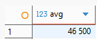

### 1. Агрегатная функция COUNT()

1.1. Количество выполненных заказов клиентов
```sql
SELECT COUNT(*) AS number_of_completed_orders
FROM client_order
WHERE status = 'выполнен';
```


1.2. 
```sql

```


### 2. Агрегатная функция SUM()

2.1.
```sql

```


2.2. Общая сумма затрат на заказы поставщикам, оформленных для точки, расположенной по адресу "ул. Ленина, 25, Москва"
```sql
SELECT SUM(total_cost) AS total_supplier_orders_cost
FROM order_to_supplier os
INNER JOIN location l ON os.id_location = l.id
WHERE address = 'ул. Ленина, 25, Москва';
```


### 3. Агрегатная функция AVG()

3.1. 
```sql

```


3.2. 
```sql

```



### 4. Агрегатная функция MIN() 

4.1. Самая ранняя дата регистрации бонусной карты клиента
```sql
SELECT MIN(registration_date) AS earliest_registration
FROM loyalty_card;
```


4.2. 
```sql

```


### 5. Агрегатная функция MAX() 

5.1. 
```sql

```


5.2. Максимальное количество баллов на бонусной карте
```sql
SELECT MAX(points_balance) AS max_points
FROM loyalty_card;
```


### 6. Агрегатная функция STRING_AGG()
6.1. 
```sql

```


6.2. 
```sql

```


### 7. Комбинирование функций

7.1. Статистика по заказам клиентов: количество, общая сумма, средняя сумма, минимальная и максимальная стоимость
```sql
SELECT 
    COUNT(*) AS orders_count,
    SUM(total_amount) AS total_sum,
    ROUND(AVG(total_amount), 2) AS average_amount,
    MIN(total_amount) AS min_amount,
    MAX(total_amount) AS max_amount
FROM client_order;
```


7.2.
```sql

```


### 8. GROUP BY 

8.1. 
```sql

```


8.2. Количество заказов клиентов по каждому приоритету
```sql
SELECT priority, COUNT(*) AS orders_count
FROM client_order
GROUP BY priority;
```


### 9. Фильтрация групп (HAVING)

9.1. 
```sql

```


9.2. 
```sql

```


### 10. Расширенная группировка - GROUPING SETS

10.1. Количество сотрудников, сгруппированных по должностям и статусам, только по должностям и только по статусам.
```sql
SELECT position, status, COUNT(*) AS employees_count
FROM employee
GROUP BY
	GROUPING SETS ((position, status), (position), (status), ())
ORDER BY position, status;
```


10.2. 
```sql

```


### 11. Расширенная группировка - ROLLUP

11.1. 
```sql

```


11.2. Количество автомобилей, сгруппированных по брендам и моделям, только по брендам. 
```sql
SELECT brand_name, model_name, COUNT(*) AS cars_count
FROM car c
INNER JOIN car_model cm ON c.model_id = cm.id
GROUP BY ROLLUP (brand_name, model_name)
ORDER BY brand_name, model_name;
```


### 12. Расширенная группировка - CUBE

12.1. 
```sql

```


12.2. 
```sql

```


