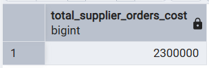

### 1. Агрегатная функция COUNT()

1.1. Количество выполненных заказов клиентов
```sql
SELECT COUNT(*) AS number_of_completed_orders
FROM client_order
WHERE status = 'выполнен';
```


1.2. Количество устроенных работников
```sql
SELECT count(*) AS number_of_employees
FROM employee 
WHERE status = 'работает';
```


### 2. Агрегатная функция SUM()

2.1. Посчитать стоимость товара на точке с id = 1
```sql
SELECT sum(quantity) FROM remains_of_goods 
WHERE location_id = 1;
```


2.2. Общая сумма затрат на заказы поставщикам, оформленных для точки, расположенной по адресу "ул. Ленина, 25, Москва"
```sql
SELECT SUM(total_cost) AS total_supplier_orders_cost
FROM order_to_supplier os
INNER JOIN location l ON os.id_location = l.id
WHERE address = 'ул. Ленина, 25, Москва';
```



### 3. Агрегатная функция AVG()

3.1. Средний чек заказа клиента
```sql
SELECT avg(total_price) AS middle
FROM client_order_items;
```


3.2. Средняя стоимость услуги
```sql
SELECT avg(base_price) FROM service;
```


### 4. Агрегатная функция MIN() 

4.1. Самая ранняя дата регистрации бонусной карты клиента
```sql
SELECT MIN(registration_date) AS earliest_registration
FROM loyalty_card;
```


4.2. Наименьшая цена на товар
```sql
SELECT min(price) AS min_price
FROM product_prices;
```


### 5. Агрегатная функция MAX() 

5.1. Максимально возможная скидка по карте
```sql
SELECT max(discount_percent) FROM loyalty_rules;
```


5.2. Максимальное количество баллов на бонусной карте
```sql
SELECT MAX(points_balance) AS max_points
FROM loyalty_card;
```


### 6. Агрегатная функция STRING_AGG()
6.1. Вывод всех названий продуктов как единой строки
```sql
SELECT string_agg(name, ',')
FROM nomenclature;
```


6.2. Все адреса точек 
```sql
SELECT string_agg(address, '  |  ') FROM "location";
```


### 7. Комбинирование функций

7.1. Статистика по заказам клиентов: количество, общая сумма, средняя сумма, минимальная и максимальная стоимость
```sql
SELECT 
    COUNT(*) AS orders_count,
    SUM(total_amount) AS total_sum,
    ROUND(AVG(total_amount), 2) AS average_amount,
    MIN(total_amount) AS min_amount,
    MAX(total_amount) AS max_amount
FROM client_order;
```


7.2. Общие данные по ценам на продаваемые продукты - их количество, средняя цена, минимальная и максимальная
```sql
SELECT 
    COUNT(*) AS products_count,
    SUM(p_p.price) AS total_sum_of_products,
    ROUND(AVG(p_p.price), 2) AS middle_price,
    MIN(p_p.price) AS min_price,
    MAX(p_p.price) AS max_price
FROM nomenclature n
INNER JOIN product_prices p_p ON n.article = p_p.article;
```


### 8. GROUP BY 

8.1. Количество товаров в заказе
```sql
SELECT id_order, count(id) AS count_of_products FROM client_order_items
GROUP BY id_order;
```


8.2. Количество заказов клиентов по каждому приоритету
```sql
SELECT priority, COUNT(*) AS orders_count
FROM client_order
GROUP BY priority;
```


### 9. Фильтрация групп (HAVING)

9.1. Все локации, где работает более 1 сотрудника
```sql
SELECT location_id, COUNT(*) AS working_employees
FROM employee
WHERE status = 'работает'
GROUP BY location_id
HAVING COUNT(*) > 1;
```


9.2. Поставщики, к которым было больше 1 заказа
```sql
SELECT s.company_name, count(ots.id) AS count_of_orders FROM supplier s 
JOIN order_to_supplier ots ON ots.id_supplier = s.id 
GROUP BY s.company_name 
HAVING count(ots.id) > 1;
```


### 10. Расширенная группировка - GROUPING SETS

10.1. Количество сотрудников, сгруппированных по должностям и статусам, только по должностям и только по статусам.
```sql
SELECT position, status, COUNT(*) AS employees_count
FROM employee
GROUP BY
	GROUPING SETS ((position, status), (position), (status), ())
ORDER BY position, status;
```


10.2. Остатки каждого товара, сумма остатков по каждому филиалу и по всем 
```sql
SELECT 
    l.address AS location,
    n.name AS product_name,
    SUM(rog.quantity) AS total_quantity
FROM remains_of_goods rog
JOIN location l ON rog.location_id = l.id
JOIN nomenclature n ON rog.article = n.article
GROUP BY GROUPING SETS (
    (l.address, n.name),
    (l.address),
    (n.name),
    ()
)
ORDER BY l.address, n.name;
```


### 11. Расширенная группировка - ROLLUP

11.1. Количество заказов по статусам и приоритетам и просто по статусам
```sql
SELECT status, priority, count(id) FROM client_order
GROUP BY rollup(status, priority);
```


11.2. Количество автомобилей, сгруппированных по брендам и моделям, только по брендам. 
```sql
SELECT brand_name, model_name, COUNT(*) AS cars_count
FROM car c
INNER JOIN car_model cm ON c.model_id = cm.id
GROUP BY ROLLUP (brand_name, model_name)
ORDER BY brand_name, model_name;
```


### 12. Расширенная группировка - CUBE

12.1. Анализ статусов сотруников
```sql
SELECT 
    position,
    status,
    COUNT(*) AS count
FROM employee
GROUP BY CUBE(position, status)
ORDER BY position, status;
```


12.2. Количество заказов по приоритету и статусу, приоритету, статусу и просто общее количество
```sql
SELECT status, priority, count(id) FROM client_order
GROUP BY cube(status, priority);
```


