### 1. CTE 
1.1 Заказы, сделанные клиентом с золотым уровнем карты
```sql 
WITH client_with_gold_card AS 
	(SELECT lc.id_client 
	FROM loyalty_card lc
	WHERE lc.points_balance >= (SELECT min_points FROM loyalty_rules lr 
		WHERE lr.level_name = 'Золото')
		AND lc.points_balance < (SELECT min_points FROM loyalty_rules lr 
		WHERE lr.level_name = 'Платина'))

SELECT co.id
FROM client_with_gold_card cg JOIN client_order co ON cg.id_client = co.id_client;
```


1.2 CTE для анализа заказов по брендам автомобилей
```sql 
WITH BrandOrders AS (
    SELECT 
        cm.brand_name,
        COUNT(co.id) as order_count,
        AVG(co.total_amount) as avg_order_amount
    FROM client_order co
    JOIN car c ON co.id_car = c.id
    JOIN car_model cm ON c.model_id = cm.id
    GROUP BY cm.brand_name
)
SELECT 
    brand_name,
    order_count,
    ROUND(avg_order_amount) as avg_order_amount
FROM BrandOrders
ORDER BY order_count DESC;
```


1.3 Товары, которые есть в наличии в московском филиале в количестве более 10 штук
```sql 
WITH MoscowItems AS (
    SELECT article, quantity
    FROM remains_of_goods rog
    INNER JOIN location l ON rog.location_id = l.id
    WHERE l.address LIKE '%Москва%'
)
SELECT n.*, mi.quantity
FROM nomenclature n
INNER JOIN MoscowItems mi ON n.article = mi.article
WHERE mi.quantity > 10;
```
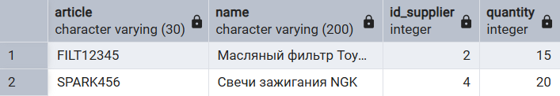

1.4 Точки, у которых средний чек больше 500к
```sql 
WITH location_orders AS 
	(SELECT id_location, avg(total_amount) AS avg_amount
	FROM client_order co 
	GROUP BY id_location)

SELECT id_location, avg_amount FROM location_orders lo
WHERE lo.avg_amount > 500000;
```


1.5 CTE для анализа поставщиков и их товаров
```sql 
WITH SupplierAnalysis AS (
    SELECT 
        s.company_name,
        COUNT(n.article) as product_count,
        COUNT(rog.article) as products_in_stock,
        AVG(pp.price) as avg_product_price
    FROM supplier s
    LEFT JOIN nomenclature n ON s.id = n.id_supplier
    LEFT JOIN product_prices pp ON n.article = pp.article
    LEFT JOIN remains_of_goods rog ON n.article = rog.article
    GROUP BY s.company_name
)
SELECT 
    company_name,
    product_count,
    products_in_stock,
    ROUND(avg_product_price) as avg_price
FROM SupplierAnalysis
ORDER BY product_count DESC;
```


### 2. UNION 

2.1 Все заказы (клиентские и поставщикам)
```sql 
SELECT 
    id as order_number,
    created_date as creation_date,
    total_amount as amount,
    'client' as order_type
FROM client_order
UNION
SELECT 
    id as order_number,
    created_date as creation_date,
    total_cost as amount,
    'supplier' as order_type
FROM order_to_supplier
ORDER BY creation_date DESC;
```


2.2 Товары/услуги и их цена
```sql 
SELECT DISTINCT sp.service_name AS name, sp.price FROM service_prices sp 
UNION 
SELECT DISTINCT n."name", pp.price 
	FROM product_prices pp JOIN nomenclature n ON pp.article = n.article;
```


2.3 Объединение клиентов и сотрудников
```sql 
SELECT full_name, phone_number, 'client' as type
FROM client
UNION
SELECT full_name, phone_number, 'employee' as type  
FROM employee;
```


### 3. INTERSECT 

3.1  Клиентов, у которых были и выполненные, и активные, и отмененные заказы
```sql 
SELECT 
    c.full_name
FROM client c
WHERE c.id IN (
    SELECT id_client
    FROM client_order 
    WHERE status = 'выполнен'
    INTERSECT
    SELECT id_client
    FROM client_order 
    WHERE status = 'в работе'
    INTERSECT
    SELECT id_client
    FROM client_order 
    WHERE status = 'отменен'
);
```


3.2 Сотрудники, которые вместе с этим являются и клиентами автосервиса
```sql 
SELECT e.full_name, e.phone_number FROM employee e
INTERSECT
SELECT c.full_name, c.phone_number FROM client c;
```


3.3 Товары, которые есть и в заказах клиентов и в заказах поставщикам
```sql 
SELECT n.article 
FROM client_order_items coi
JOIN product_prices pp ON coi.product_price_id = pp.id
JOIN nomenclature n ON pp.article = n.article
JOIN client_order co ON coi.id_order = co.id
WHERE co.status = 'выполнен'
INTERSECT
SELECT article 
FROM supplier_order_items soi
JOIN order_to_supplier os ON soi.id_order = os.id
WHERE os.status = 'доставлен';
```


### 4. EXCEPT 

4.1 Клиенты без лояльной карты
```sql 
SELECT 
    full_name
FROM client
WHERE id IN (
    SELECT id FROM client
    EXCEPT
    SELECT id_client FROM loyalty_card
);
```


4.2 Сотрудники, которые не являются клиентами автосервиса
```sql 
SELECT e.full_name, e.phone_number FROM employee e
EXCEPT  
SELECT c.full_name, c.phone_number FROM client c;
```
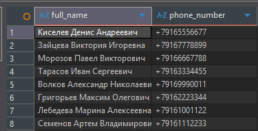

4.3 Товары без остатков на складе
```sql 
SELECT article FROM nomenclature
EXCEPT
SELECT article FROM remains_of_goods;
```
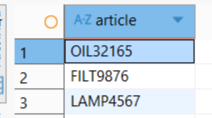

### 5. PARTITION BY 

5.1 Количество заказов на каждого сотрудника
```sql 
SELECT 
    co.id AS order_id,
    e.full_name AS employee_name,
    co.total_amount,
    COUNT(*) OVER (PARTITION BY co.employee_id) AS total_orders_by_employee
FROM client_order co
JOIN employee e ON co.employee_id = e.id
ORDER BY e.full_name, co.created_date;
```
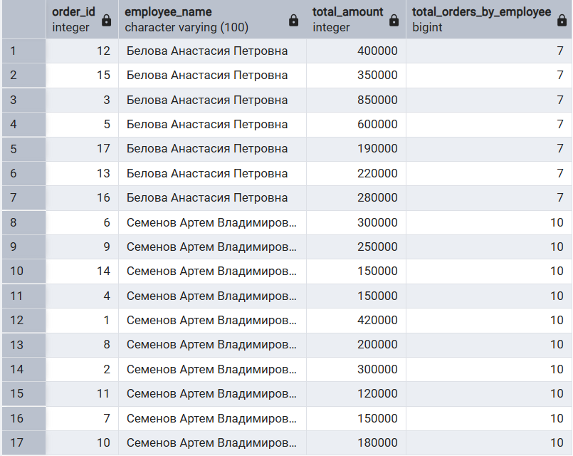

5.2 Заказы со средним ценником по локациям
```sql 
SELECT co.id, co.id_location, 
	avg(co.total_amount) OVER (PARTITION BY co.id_location) AS avg_amount_on_location
FROM client_order co;
```
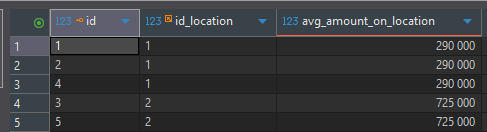

### 6. PARTITION BY + ORDER BY 

6.1 Накопительная сумма по клиентам
```sql 
SELECT 
    id_client,
    total_amount,
    created_date,
    SUM(total_amount) OVER (
        PARTITION BY id_client 
        ORDER BY created_date
    ) as cumulative_sum
FROM client_order;
```


6.2 Накопительное количество заказов по каждому сотруднику во времени
```sql 
SELECT 
    e.full_name AS employee_name,
    co.id AS order_id,
    co.created_date,
    COUNT(*) OVER (
        PARTITION BY co.employee_id 
        ORDER BY co.created_date
    ) AS cumulative_orders
FROM client_order co
JOIN employee e ON co.employee_id = e.id;
```


### 7. ROWS 

7.1 Количество сотрудников, принятых на работу после того, как приняли конкретно этого сотрудника 
```sql 
SELECT full_name, hire_date,
    count(*) OVER (ORDER BY hire_date ASC 
                   ROWS BETWEEN 1 FOLLOWING AND UNBOUNDED FOLLOWING) AS count_after
FROM employee;
```
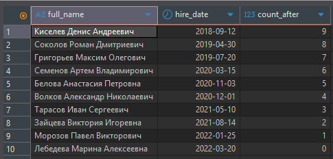

7.2 Скользящее среднее за 2 последних заказа
```sql 
SELECT 
    id,
    total_amount,
    AVG(total_amount) OVER (
        ORDER BY created_date
        ROWS BETWEEN 1 PRECEDING AND CURRENT ROW
    ) as moving_avg
FROM client_order;
```


### 8. RANGE

8.1 Средняя сумма заказов клиентов, близких по стоимости (±100 000)
```sql 
SELECT 
    id AS order_id,
    total_amount,
    ROUND(
        AVG(total_amount) OVER (
            ORDER BY total_amount
            RANGE BETWEEN 100000 PRECEDING AND 100000 FOLLOWING
        )
    ) AS avg_amount_in_range
FROM client_order;
```


8.2 Клиенты, у которых на карте +- 100 баллов
```sql 
SELECT id_client, points_balance,
    COUNT(*) OVER (ORDER BY points_balance 
                   RANGE BETWEEN 100 PRECEDING AND 100 FOLLOWING) - 1
                   AS clients_with_similar_points
FROM loyalty_card;
```
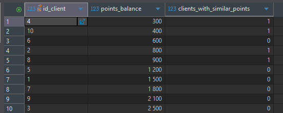

### 9. Ранжирующие оконные функции

#### 9.1 ROW_NUMBER Нумерация заказов клиента
```sql 
SELECT 
    id_client,
    id,
    total_amount,
    ROW_NUMBER() OVER (
        PARTITION BY id_client 
        ORDER BY created_date
    ) as order_num
FROM client_order;
```
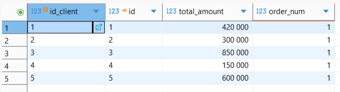

#### 9.2 RANK Ранжирование сотрудников по общей сумме выполненных заказов
```sql 
WITH EmployeeRevenue AS (
    SELECT 
        e.id,
        e.full_name,
        e.position,
        COALESCE(SUM(co.total_amount), 0) AS total_revenue
    FROM employee e
    LEFT JOIN client_order co 
        ON e.id = co.employee_id 
        AND co.status = 'выполнен'
    GROUP BY e.id, e.full_name, e.position
)
SELECT 
    full_name,
    position,
    total_revenue,
    RANK() OVER (ORDER BY total_revenue DESC) AS revenue_rank
FROM EmployeeRevenue;
```


#### 9.3 DENSE_RANK Ранг по количеству баллов на карте
```sql 
SELECT id_client, points_balance, 
    DENSE_RANK() OVER (ORDER BY points_balance DESC) AS client_rank
FROM loyalty_card;
```
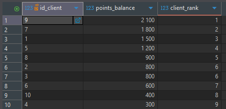

### 10. Функции смещения

#### 10.1 LAG Сравнение с предыдущим заказом
```sql 
SELECT 
    id,
    total_amount,
    LAG(total_amount) OVER (ORDER BY created_date) as prev_amount
FROM client_order;
```
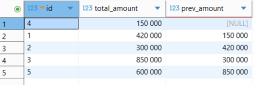

#### 10.2 LEAD Следующий визит клиента и интервал между заказами
```sql 
SELECT 
    c.full_name AS client_name,
    co.id AS order_id,
    co.created_date AS current_visit,
    LEAD(co.created_date) OVER (
        PARTITION BY co.id_client 
        ORDER BY co.created_date
    ) AS next_visit,
    (
        LEAD(co.created_date) OVER (
            PARTITION BY co.id_client 
            ORDER BY co.created_date
        ) - co.created_date
    ) AS days_until_next
FROM client_order co
JOIN client c ON co.id_client = c.id
WHERE co.status = 'выполнен';
```
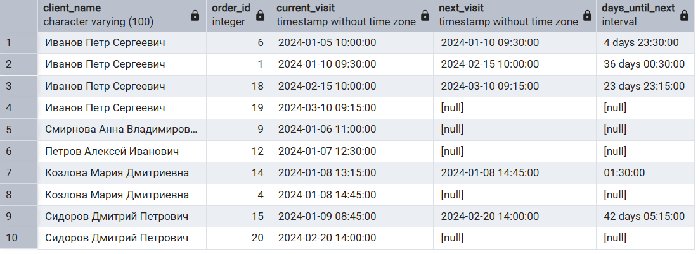

#### 10.3 FIRST_VALUE Стоимость самого дорогого товара в заказе
```sql 
SELECT coi.id, coi.id_order, coi.unit_price,
	FIRST_VALUE(coi.unit_price) OVER (PARTITION BY coi.id_order ORDER BY coi.unit_price) AS most_expensive_item
FROM client_order_items coi;
```


#### 10.4 LAST_VALUE Последний заказ клиента
```sql 
SELECT DISTINCT
    id_client,
    LAST_VALUE(total_amount) OVER (
        PARTITION BY id_client
        ORDER BY created_date
        ROWS BETWEEN UNBOUNDED PRECEDING AND UNBOUNDED FOLLOWING
    ) as last_order_amount
FROM client_order;
```
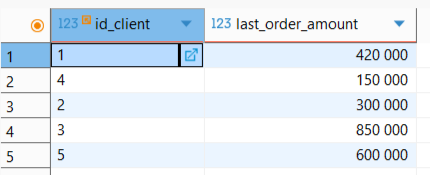
