## 1. Процедуры 3 шт + запрос просмотра всех процедур
### Процедуры:
1.1 Изменение статуса сотрудника
``` sql
CREATE OR REPLACE PROCEDURE update_emloyee_status(
	employee_id INTEGER, 
	new_status employee_status
)
LANGUAGE plpgsql 
AS $$ 
BEGIN 
	UPDATE employee
	SET status = new_status
	WHERE id = employee_id;
END;
$$;

CALL update_emloyee_status(1, 'отпуск'::employee_status);
```


1.2. Оформление заказа
``` sql
CREATE OR REPLACE PROCEDURE create_car_service_order(
    p_client_id INTEGER,
    p_car_id INTEGER,
    p_location_id INTEGER,
    p_employee_id INTEGER,
    p_notes TEXT DEFAULT NULL
)
LANGUAGE plpgsql
AS $$
BEGIN
    -- Создаем новый заказ
    INSERT INTO client_order (id_client, id_car, id_location, employee_id, notes, status)
    VALUES (p_client_id, p_car_id, p_location_id, p_employee_id, p_notes, 'создан');
    
    -- Обновляем дату последнего визита в карте лояльности
    UPDATE loyalty_card 
    SET last_visit_date = CURRENT_DATE 
    WHERE id_client = p_client_id;
END;
$$;

SELECT 
    id AS order_id,
    id_client,
    created_date,
    status
FROM client_order 
WHERE id_client = 2 
ORDER BY id DESC 
LIMIT 2;

CALL create_car_service_order(2, 2, 1, 1, 'Диагностика ходовой');

SELECT 
    id AS order_id,
    id_client,
    created_date,
    status,
    notes
FROM client_order 
WHERE id_client = 2 
ORDER BY id DESC 
LIMIT 3;

SELECT 
    c.full_name,
    lc.last_visit_date,
    lc.points_balance
FROM loyalty_card lc
JOIN client c ON lc.id_client = c.id
WHERE lc.id_client = 2;
```
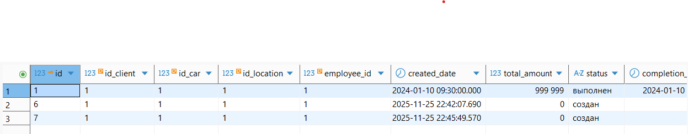
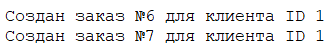


1.3. Процедура для добавления нового клиента с картой лояльности
``` sql
CREATE OR REPLACE PROCEDURE add_client_with_loyalty(
	new_full_name VARCHAR(100),
	new_phone_number VARCHAR(12),
	new_email VARCHAR(100),
	new_driver_license VARCHAR(20)
)
LANGUAGE plpgsql
AS $$
DECLARE
	new_client_id INT;
BEGIN
	-- вставка нового клиента
	INSERT INTO client (full_name, phone_number, email, driver_license)
	VALUES (new_full_name, new_phone_number, new_email, new_driver_license);

    -- id нового клиента
	SELECT id INTO new_client_id
	FROM client
	WHERE driver_license = new_driver_license;

    -- создание карты лояльности для клиента
	INSERT INTO loyalty_card (id_client, registration_date, points_balance)
	VALUES (new_client_id, CURRENT_DATE, 0);
END;
$$;

CALL add_client_with_loyalty('Петрова Мария Ивановна', '+79167654321', 'petrova@mail.ru', 'CD987654321');

SELECT c.id, c.full_name, c.phone_number, c.driver_license, lc.card_number, lc.points_balance
FROM client c
INNER JOIN loyalty_card lc ON c.id = lc.id_client;
```


### Запрос просмотра всех процедур:
1.4.
``` sql
SELECT routine_name, routine_type 
FROM information_schema."routines" r 
WHERE r.routine_type = 'PROCEDURE' AND r.routine_schema = 'public';
```


## 2. Функции 3 шт  + функции с переменными 3 шт + запрос просмотра всех функций
### Функции:
2.1. Расчет итоговой суммы со скидкой по карте лояльности
``` sql
CREATE OR REPLACE FUNCTION calculate_amount_with_sale(
    client_id INTEGER,
    amount INTEGER 
)
RETURNS INTEGER 
LANGUAGE plpgsql 
AS $$
BEGIN
    RETURN (
        WITH client_points AS (
            SELECT points_balance 
            FROM loyalty_card 
            WHERE id_client = client_id
        ),
        max_discount AS (
            SELECT MAX(lr.discount_percent) as discount
            FROM loyalty_rules lr
            CROSS JOIN client_points cp
            WHERE lr.min_points <= cp.points_balance
        )
        SELECT amount - (amount * discount / 100)
        FROM max_discount
    );
END;
$$;

SELECT calculate_amount_with_sale(1, 200000) AS amount_with_discount;
```
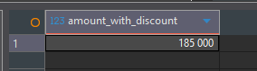

2.2. Функция для расчета стоимости замены масла
``` sql
CREATE OR REPLACE FUNCTION calculate_oil_change_cost_simple(
    p_car_model_id INTEGER,
    p_oil_quantity INTEGER
)
RETURNS INTEGER
LANGUAGE plpgsql
AS $$
DECLARE
    oil_price INTEGER;
    service_cost INTEGER;
    total_cost INTEGER;
BEGIN
    SELECT price INTO oil_price
    FROM product_prices pp
    JOIN nomenclature n ON pp.article = n.article
    WHERE n.name LIKE '%Моторное масло%'
    ORDER BY pp.effective_date DESC
    LIMIT 1;
    
    SELECT price INTO service_cost
    FROM service_prices
    WHERE service_name = 'Замена масла'
    ORDER BY effective_date DESC
    LIMIT 1;
    
    total_cost := (oil_price * p_oil_quantity) + service_cost;
    
    RETURN total_cost;
END;
$$;

SELECT 
    1 AS car_model_id,
    5 AS oil_quantity,
    (SELECT model_name FROM car_model WHERE id = 1) AS car_model,
    calculate_oil_change_cost_simple(1, 5) AS total_cost;
```


2.3. Функция для получения текущего баланса баллов лояльности клиента по ФИО и номеру
``` sql
CREATE OR REPLACE FUNCTION get_client_points(f_full_name VARCHAR(100), f_phone_number VARCHAR(12))
RETURNS INT
LANGUAGE plpgsql
AS $$
BEGIN
	RETURN (SELECT points_balance
			FROM loyalty_card 
			INNER JOIN client ON loyalty_card.id_client = client.id
			WHERE full_name = f_full_name AND phone_number = f_phone_number);
END;
$$;

SELECT get_client_points('Федорова Елена Александровна', '+79166789012') AS loyalty_points;
```
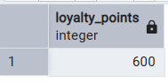

### Функции с переменными:
2.4. Расчет зарплаты сотрудника
``` sql
CREATE OR REPLACE FUNCTION calculate_employee_salary(
    employee INTEGER
)
RETURNS INTEGER 
LANGUAGE plpgsql 
AS $$
DECLARE
    working_days INTEGER;
BEGIN
	SELECT COUNT(*) INTO working_days
	FROM employee_shift_schedule
	WHERE employee_id = employee;
    
	RETURN working_days * 3000;
END;
$$;

SELECT calculate_employee_salary(4) AS salary;
```
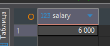

2.5. Функция с переменными для проверки доступности запчастей
``` sql
CREATE OR REPLACE FUNCTION check_parts_availability(
    p_article VARCHAR(30),
    p_required_quantity INTEGER,
    p_location_id INTEGER
)
RETURNS BOOLEAN
LANGUAGE plpgsql
AS $$
DECLARE
    current_stock INTEGER;
    is_available BOOLEAN;
    part_name VARCHAR(200);
BEGIN
    -- Получаем текущий остаток и название детали
    SELECT rog.quantity, n.name 
    INTO current_stock, part_name
    FROM remains_of_goods rog
    JOIN nomenclature n ON rog.article = n.article
    WHERE rog.article = p_article 
    AND rog.location_id = p_location_id;
    
    -- Проверяем доступность
    IF current_stock >= p_required_quantity THEN
        is_available := TRUE;
        RAISE NOTICE 'Деталь "%" доступна в количестве % (требуется: %)', 
            part_name, current_stock, p_required_quantity;
    ELSE
        is_available := FALSE;
        RAISE NOTICE 'Деталь "%" недоступна! В наличии: %, требуется: %', 
            part_name, current_stock, p_required_quantity;
    END IF;
    
    RETURN is_available;
END;
$$;

SELECT 
    'FILT12345' AS article,
    3 AS required_quantity,
    1 AS location_id,
    check_parts_availability('FILT12345', 3, 1) AS parts_available,
    (SELECT name FROM nomenclature WHERE article = 'FILT12345') AS part_name;
```


2.6. Итоговая сумма заказа клиента с учетом скидки по баллам лояльности
``` sql
CREATE OR REPLACE FUNCTION calculate_order_total_with_discount(f_order_id INT)
RETURNS INT
LANGUAGE plpgsql
AS $$
DECLARE
	total_items INT;
	total_services INT;
	total_without_discount INT;
	client_points INT;
	f_discount_percent NUMERIC;
    final_total INT;	
BEGIN
    -- Сумма всех товаров в заказе
	SELECT COALESCE(SUM(total_price), 0) INTO total_items
	FROM client_order_items
	WHERE id_order = f_order_id; 

	-- Сумма всех услуг в заказе 
	SELECT COALESCE(SUM(total_price), 0) INTO total_services
	FROM client_order_services
	WHERE id_order = f_order_id; 

	-- Общая сумма без скидки
    total_without_discount := total_items + total_services;

	-- Баллы лояльности клиента 
    SELECT COALESCE(lc.points_balance, 0) INTO client_points
    FROM client_order co
    INNER JOIN loyalty_card lc ON co.id_client = lc.id_client
    WHERE co.id = f_order_id;

	-- Максимальная доступная скидка по баллам 
    SELECT COALESCE(MAX(discount_percent), 0) INTO f_discount_percent
    FROM loyalty_rules
    WHERE min_points <= client_points;

	-- Итоговая сумма со скидкой
    final_total := total_without_discount * (1 - f_discount_percent / 100);

	RETURN final_total;
END;
$$;

SELECT calculate_order_total_with_discount(1) AS final_amount;
```


### Запрос просмотра всех функций:
2.7.
``` sql
SELECT routine_name, routine_type 
FROM information_schema."routines" r 
WHERE r.routine_type = 'FUNCTION' AND r.routine_schema = 'public';
```


## 3. Блок DO 3 шт
3.1. Повышение базовой стоимости услуги на 10%  
``` sql
DO $$
BEGIN
    UPDATE service 
    SET base_price = base_price * 1.1;
END $$;
```
До: 

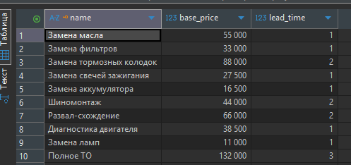

После: 


3.2. Для обновления статусов сотрудников
``` sql
DO $$
DECLARE
    emp_record RECORD;
BEGIN
    -- Автоматически переводим сотрудников в статус "работает", 
    -- если они были в отпуске больше 30 дней
    FOR emp_record IN 
        SELECT id, full_name, hire_date 
        FROM employee 
        WHERE status = 'отпуск' 
        AND hire_date < CURRENT_DATE - INTERVAL '30 days'
    LOOP
        UPDATE employee 
        SET status = 'работает' 
        WHERE id = emp_record.id;
        
        RAISE NOTICE 'Сотрудник % возвращен из отпуска', emp_record.full_name;
    END LOOP;
    
    -- Логируем общее количество обновленных записей
    RAISE NOTICE 'Обновлено статусов: %', FOUND;
END $$;

SELECT id, full_name, status 
FROM employee 
WHERE status = 'работает';
```
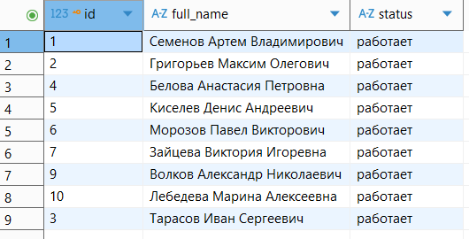
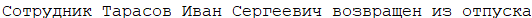

3.3. Обновленные суммы в выполненных заказах, рассчитанные с учетом скидки по баллам лояльности клиентов.
``` sql
DO $$
BEGIN
    UPDATE client_order 
    SET total_amount = calculate_order_total_with_discount(id)
    WHERE status = 'выполнен';
END $$;
```
Было: 
Стало: 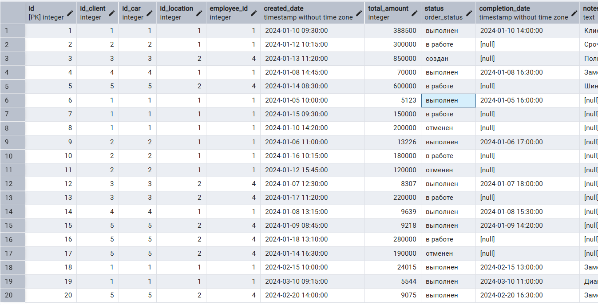

## 4. IF 1 шт
4.1. Определение статуса клиента в зависимости от даты регистрации карты лояльности
``` sql
CREATE OR REPLACE FUNCTION get_client_status(
    client_id INTEGER
)
RETURNS VARCHAR(20) 
LANGUAGE plpgsql 
AS $$
DECLARE
	registration DATE; 
	min_reg DATE; 
	max_reg DATE;
	status VARCHAR(20);
BEGIN
    SELECT registration_date INTO registration
	FROM loyalty_card 
	WHERE id_client = client_id;

	SELECT MIN(registration_date) INTO min_reg
	FROM loyalty_card; 
	
	SELECT MAX(registration_date) INTO max_reg
	FROM loyalty_card; 

	IF registration = min_reg THEN 
		status := 'старичок';
	ELSIF registration = max_reg THEN 
		status := 'сапог';
	ELSE 
		status := 'нормис';
	END IF;

	RETURN status;
END;
$$;

SELECT get_client_status(5) AS status;
```


## 5. CASE 1 шт
5.1. Определение категории сложности заказа
``` sql
CREATE OR REPLACE FUNCTION get_order_complexity(p_order_id INTEGER)
RETURNS VARCHAR(50)
LANGUAGE plpgsql
AS $$
DECLARE
    services_count INTEGER;
    items_count INTEGER;
    total_items INTEGER;
    complexity_category VARCHAR(50);
BEGIN
    -- Считаем количество услуг и товаров в заказе
    SELECT COUNT(*) INTO services_count
    FROM client_order_services
    WHERE id_order = p_order_id;
    
    SELECT COUNT(*) INTO items_count
    FROM client_order_items
    WHERE id_order = p_order_id;
    
    total_items := services_count + items_count;
    
    -- Определяем категорию сложности
    complexity_category := 
        CASE 
            WHEN total_items = 0 THEN 'Консультация'
            WHEN total_items = 1 THEN 'Простая работа'
            WHEN total_items BETWEEN 2 AND 3 THEN 'Средняя сложность'
            WHEN total_items BETWEEN 4 AND 6 THEN 'Сложная работа'
            ELSE 'Очень сложная работа'
        END;
    
    RETURN complexity_category;
END;
$$;

SELECT 
    id AS order_id,
    total_amount,
    get_order_complexity(id) AS complexity
FROM client_order 
WHERE status = 'выполнен'
LIMIT 5;
```


## 6. WHILE 2 шт
6.1. Процедура для добавления 100 баллов первым 3 клиентам с наибольшим количеством заказов
``` sql
CREATE OR REPLACE PROCEDURE add_points_to_top_clients()
LANGUAGE plpgsql
AS $$
DECLARE
    client_id INTEGER;
    i INTEGER := 1;
BEGIN
    WHILE i <= 3 LOOP
        SELECT co.id_client INTO client_id
        FROM client_order co
        GROUP BY co.id_client
        ORDER BY COUNT(*) DESC
        LIMIT 1
        OFFSET i - 1;
        
        UPDATE loyalty_card 
        SET points_balance = points_balance + 100
        WHERE id_client = client_id;
        
        i := i + 1;
    END LOOP;
END;
$$;

CALL add_points_to_top_clients();
```
Было: 
Стало: 

6.2. Увольняем топ N малоработающих сотрудников
``` sql
CREATE OR REPLACE PROCEDURE fire_lazy_employees(
    n INTEGER
)
LANGUAGE plpgsql 
AS $$
DECLARE 
    lazy_employee_id INTEGER;
    i INTEGER := 0;
BEGIN
    WHILE i < n LOOP
        SELECT ess.employee_id INTO lazy_employee_id
        FROM employee_shift_schedule ess
        JOIN employee e ON e.id = ess.employee_id AND e.status != 'уволен'
        GROUP BY ess.employee_id
        ORDER BY COUNT(ess.id) ASC
        LIMIT 1;
        
        IF lazy_employee_id IS NULL THEN
            EXIT;
        END IF;
        
        UPDATE employee 
        SET status = 'уволен'
        WHERE id = lazy_employee_id;
        
        i := i + 1;
    END LOOP;
END;
$$;

CALL fire_lazy_employees(5);
```
До: 


После: 

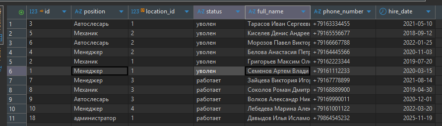

## 7. EXCEPTION 2 шт
7.1. Обработка дублирования клиентов
``` sql
CREATE OR REPLACE FUNCTION add_new_client_safe(
    p_full_name VARCHAR(100),
    p_phone_number VARCHAR(12),
    p_driver_license VARCHAR(20)
)
RETURNS INTEGER
LANGUAGE plpgsql
AS $$
DECLARE
    new_client_id INTEGER;
BEGIN
    -- Пытаемся добавить нового клиента
    INSERT INTO client (full_name, phone_number, driver_license)
    VALUES (p_full_name, p_phone_number, p_driver_license)
    RETURNING id INTO new_client_id;
    
    -- Автоматически создаем карту лояльности
    INSERT INTO loyalty_card (id_client, registration_date, points_balance)
    VALUES (new_client_id, CURRENT_DATE, 0);
    
    RAISE NOTICE 'Клиент % успешно добавлен с ID %', p_full_name, new_client_id;
    RETURN new_client_id;
    
EXCEPTION
    WHEN unique_violation THEN
        -- Если клиент уже существует (по номеру прав или телефону)
        RAISE NOTICE 'Клиент с такими данными уже существует';
        RETURN -1;
    WHEN OTHERS THEN
        RAISE NOTICE 'Ошибка при добавлении клиента: %', SQLERRM;
        RETURN -2;
END;
$$;

SELECT add_new_client_safe('Новый Клиент', '+79169998877', 'NEW123456') AS result;

SELECT 
    id,
    full_name,
    phone_number,
    driver_license
FROM client 
WHERE full_name LIKE '%Иванов%' OR phone_number = '+79169998877'
ORDER BY id;
```

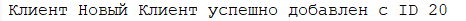

7.2. Функция для расчета средней суммы заказа клиента с обработкой деления на ноль
``` sql
CREATE OR REPLACE FUNCTION calculate_avg_order_amount(f_client_id INTEGER)
RETURNS NUMERIC
LANGUAGE plpgsql
AS $$
DECLARE
    f_total_orders INTEGER;
    f_total_amount INTEGER;
    f_avg_amount NUMERIC;
BEGIN
    SELECT COUNT(*), COALESCE(SUM(total_amount), 0)
    INTO f_total_orders, f_total_amount
    FROM client_order
    WHERE id_client = f_client_id;
    
    f_avg_amount := f_total_amount / f_total_orders;
    
    RETURN f_avg_amount;
    
EXCEPTION
    WHEN division_by_zero THEN
        RAISE NOTICE 'У клиента ID % нет заказов', f_client_id;
        RETURN 0;
	WHEN OTHERS THEN
		RAISE NOTICE 'Ошибка расчета';
	    RETURN -1;
END;
$$;

SELECT calculate_avg_order_amount(1); 
SELECT calculate_avg_order_amount(999); 
```
Для клиента с id = 1: 
Для клиента с id = 999: 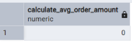


## 8. RAISE 2 шт
8.1. Проверка на найм людей из черного списка автосервиса
``` sql
CREATE OR REPLACE PROCEDURE add_new_employee(
    p_position VARCHAR(50),
    p_location_id INTEGER,
    p_full_name VARCHAR(100),
    p_phone_number VARCHAR(12),
    p_hire_date DATE DEFAULT CURRENT_DATE
)
LANGUAGE plpgsql
AS $$
BEGIN
	IF p_full_name IN ('Иванов Петр Ильич', 'Сорокина Ярослава Тимофеевна') THEN 
		RAISE WARNING 'Вы нанимаете опасных людей!!! Они в черном списке автосервиса'; 
	END IF; 

    INSERT INTO employee (
        position,
        location_id,
        status,
        full_name,
        phone_number,
        hire_date
    ) VALUES (
        p_position,
        p_location_id,
        'работает'::employee_status,
        p_full_name,
        p_phone_number,
        p_hire_date
    );
END;
$$;

CALL add_new_employee('механик', 1, 'Иванов Петр Ильич', '+74564561221');

```


8.2. Уведомления о низком уровне запасов
``` sql
CREATE OR REPLACE FUNCTION check_inventory_levels()
RETURNS VOID
LANGUAGE plpgsql
AS $$
DECLARE
    low_stock_record RECORD;
    critical_count INTEGER := 0;
BEGIN
    RAISE INFO 'Проверка уровня запасов на %', CURRENT_DATE;
    
    -- Проверяем критические остатки
    FOR low_stock_record IN 
        SELECT 
            l.address AS location,
            n.article,
            n.name AS product_name,
            rog.quantity
        FROM remains_of_goods rog
        JOIN nomenclature n ON rog.article = n.article
        JOIN location l ON rog.location_id = l.id
        WHERE rog.quantity < 5
        ORDER BY rog.quantity ASC
    LOOP
        IF low_stock_record.quantity = 0 THEN
            RAISE EXCEPTION 'КРИТИЧЕСКИЙ УРОВЕНЬ! Деталь "%" отсутствует в филиале "%"', 
                low_stock_record.product_name, low_stock_record.location;
        ELSIF low_stock_record.quantity < 3 THEN
            RAISE WARNING 'Низкий запас: "%" - осталось % шт в филиале "%"', 
                low_stock_record.product_name, low_stock_record.quantity, low_stock_record.location;
        ELSE
            RAISE NOTICE 'Маленький запас: "%" - осталось % шт в филиале "%"', 
                low_stock_record.product_name, low_stock_record.quantity, low_stock_record.location;
        END IF;
        
        critical_count := critical_count + 1;
    END LOOP;
    
    IF critical_count = 0 THEN
        RAISE INFO 'Все запасы в норме';
    ELSE
        RAISE WARNING 'Обнаружено % позиций с низким уровнем запасов', critical_count;
    END IF;
END;
$$;

WITH inventory AS (
    SELECT 
        l.address AS филиал,
        n.name AS деталь,
        rog.quantity AS остаток,
        CASE 
            WHEN rog.quantity = 0 THEN 'КРИТИЧЕСКИЙ'
            WHEN rog.quantity < 3 THEN 'НИЗКИЙ' 
            WHEN rog.quantity < 5 THEN 'МАЛЕНЬКИЙ'
            ELSE 'НОРМА'
        END AS уровень
    FROM remains_of_goods rog
    JOIN nomenclature n ON rog.article = n.article
    JOIN location l ON rog.location_id = l.id
    WHERE rog.quantity < 5
)
SELECT * FROM inventory
UNION ALL
SELECT 
    '=== ВЫЗОВ ФУНКЦИИ ===' AS филиал,
    'check_inventory_levels()' AS деталь,
    NULL AS остаток,
    NULL AS уровень;

SELECT check_inventory_levels();
```
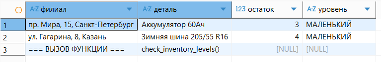
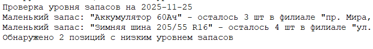
