## 1. Базовые операции с транзакциями
### 1.1. Транзакции с BEGIN ... COMMIT, которые добавляют новые записи в одну таблицу и обновляют связанные записи в другой.
1.1.1. При оформлении заказа начисляются баллы на карту клиента
``` sql
BEGIN;
INSERT INTO client_order
(id_client, id_car, id_location, employee_id, total_amount, status, completion_date, notes, created_date)
VALUES
    (2, 2, 1, 1, 200000, 'создан', '2025-12-01 09:30:00.000000', 'аккуратно с аккумулятором!', '2025-11-18 09:30:00.000000');
UPDATE loyalty_card
SET points_balance = points_balance + 20
WHERE id_client = 2;
COMMIT;
```
**Описание результата:**

Заказ создан, баллы изменились

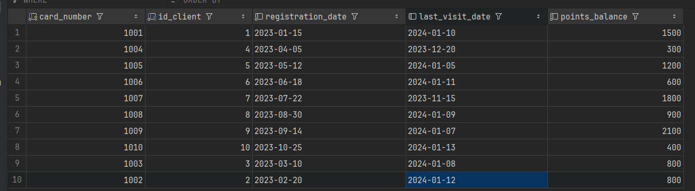
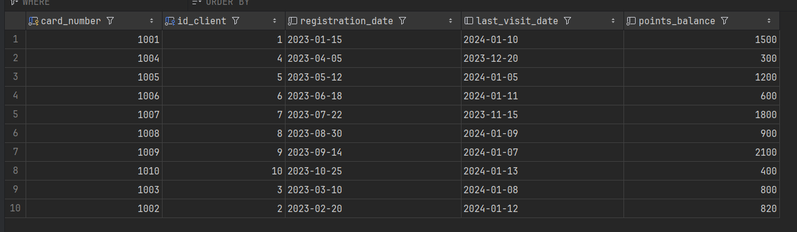

1.1.2. Добавление товара в заказ клиента и обновление остатков товаров
``` sql
BEGIN;
-- Добавляем товар в заказ клиента
INSERT INTO client_order_items (id_order, product_price_id, quantity, unit_price) 
VALUES (1, 1, 2, 1500);
-- Обновляем остатки товаров на складе
UPDATE remains_of_goods SET quantity = quantity - 2 
WHERE location_id = 1 AND article = (SELECT article FROM product_prices WHERE id = 1);
COMMIT;
```
**Описание результата:**

client_order_items и remains_of_goods до транзакции: 

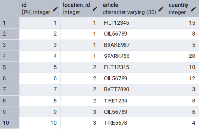

INSERT - добавлена запись в client_order_items с количеством 2 единицы товара

UPDATE - уменьшены остатки товара FILT12345 на складе location_id = 1 с 15 до 13 единиц

client_order_items и remains_of_goods после транзакции: 
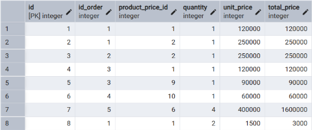


### 1.2. Транзакции с ROLLBACK вместо COMMIT.
1.2.1. При оформлении заказа начисляются баллы на карту клиента
``` sql
BEGIN;
INSERT INTO client_order
(id_client, id_car, id_location, employee_id, total_amount, status, completion_date, notes, created_date)
VALUES
    (2, 2, 1, 1, 200000, 'создан', '2025-12-01 09:30:00.000000', 'аккуратно с аккумулятором!', '2025-11-18 09:30:00.000000');
UPDATE loyalty_card
SET points_balance = points_balance + 20
WHERE id_client = 2;
ROLLBACK;
```
**Описание результата:**

Ничего не изменилось
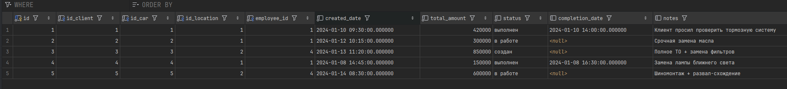


1.2.2. Откат добавления товара в заказ и обновления остатков
``` sql
BEGIN;
-- Добавляем товар в заказ клиента
INSERT INTO client_order_items (id_order, product_price_id, quantity, unit_price) 
VALUES (1, 1, 2, 1500);
-- Обновляем остатки товаров на складе
UPDATE remains_of_goods SET quantity = quantity - 2 
WHERE location_id = 1 AND article = (SELECT article FROM product_prices WHERE id = 1);
ROLLBACK;
```
**Описание результата:**

Все изменения откатываются - товар не добавляется в заказ и остатки на складе не уменьшаются. База данных возвращается в исходное состояние.

client_order_items и remains_of_goods после транзакции остаются такими же: 

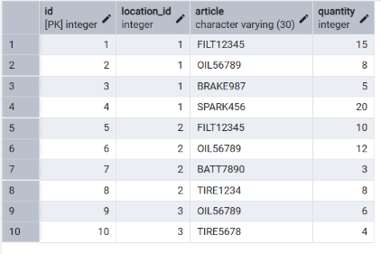

### 1.3. Транзакции с ошибкой.
1.3.1. Деление на ноль
``` sql
BEGIN;
INSERT INTO client_order
(id_client, id_car, id_location, employee_id, total_amount, status, completion_date, notes, created_date)
VALUES
    (2, 2, 1, 1, 200000, 'создан', '2025-12-01 09:30:00.000000', 'аккуратно с аккумулятором!', '2025-11-18 09:30:00.000000');
UPDATE loyalty_card
SET points_balance = points_balance / 0
WHERE id_client = 2;
ROLLBACK;
```
**Описание результата:**

При выполнении возникла ошибка во втором запросе, ни в client_order, ни в loyalty_card изменения внесены не были
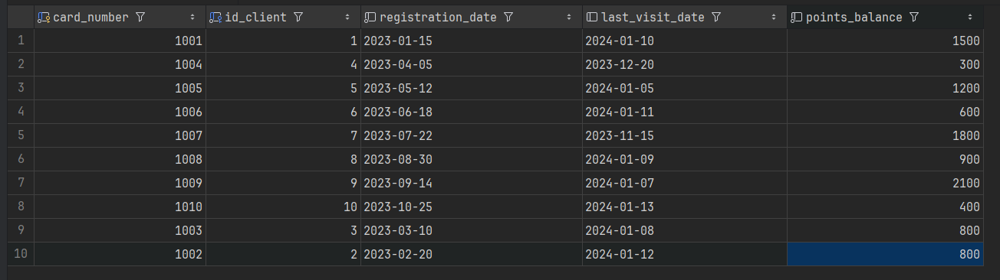


1.3.2. Ошибка при добавлении товара в заказ и обновлении остатков
``` sql
BEGIN;
-- Добавляем товар в заказ клиента
INSERT INTO client_order_items (id_order, product_price_id, quantity, unit_price) 
VALUES (1, 1, -5, 1500);  -- Ошибка: CHECK (quantity > 0)
-- Обновляем остатки товаров на складе (этот код не выполнился)
UPDATE remains_of_goods SET quantity = quantity - 2 
WHERE location_id = 1 AND article = (SELECT article FROM product_prices WHERE id = 1);
COMMIT;
```
**Описание результата:**

Транзакция автоматически откатывается из-за ошибки нарушения CHECK (quantity > 0). Ни одна из операций не выполняется - ни добавление товара с отрицательным количеством, ни обновление остатков.
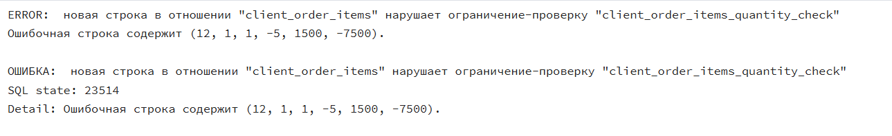
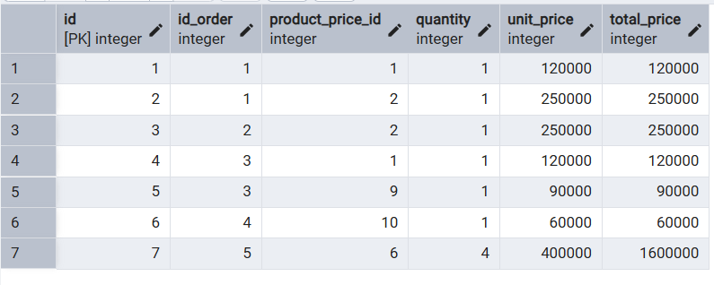
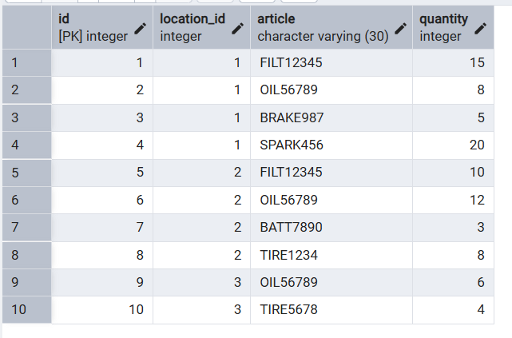


**Вывод:**
Транзакции обеспечивают атомарность - все операции выполняются вместе (COMMIT) или откатываются вместе (ROLLBACK/ошибка). При ошибках PostgreSQL автоматически откатывает всю транзакцию, сохраняя целостность данных. ROLLBACK полностью восстанавливает исходное состояние, как будто транзакция не выполнялась.

## 2. Уровни изоляции
### 2.1. READ UNCOMMITTED Проверяем, может ли менеджер увидеть незавершенные изменения email клиента, которые другой менеджер еще не подтвердил
2.1.1. 
``` sql
-- T1:
BEGIN;
UPDATE client SET email = 'грязные_uncommitted@mail.ru' WHERE id = 3;
SELECT id, full_name, email FROM client WHERE id = 3; -- Скриншот 1: данные изменены в T1

-- T2:
BEGIN;
SET TRANSACTION ISOLATION LEVEL READ UNCOMMITTED;
SELECT id, full_name, email FROM client WHERE id = 3; -- Скриншот 2: проверка грязных данных в READ UNCOMMITTED
COMMIT;

-- T1:
ROLLBACK;
SELECT id, full_name, email FROM client WHERE id = 3; -- Скриншот 3: откат изменений
```
**Описание результата:**
T1 изменил email клиента, но не закоммитил изменения. T2 при уровне READ UNCOMMITTED не увидел измененных данных - увидел старый email. После ROLLBACK в T1 изменения откатились, данные вернулись к исходным


2.1.2. READ COMMITTED Проверяем, видит ли система учета изменения статуса заказа, которые еще не подтверждены другим сотрудником
``` sql
-- T1:
BEGIN;
UPDATE client_order SET status = 'отменен' WHERE id = 4;
SELECT id, status, total_amount FROM client_order WHERE id = 4; -- Скриншот 1: данные изменены в T1

-- T2:
BEGIN;
SET TRANSACTION ISOLATION LEVEL READ COMMITTED;
SELECT id, status, total_amount FROM client_order WHERE id = 4; -- Скриншот 2: проверка грязных данных в READ COMMITTED
COMMIT;

-- T1:
ROLLBACK;
SELECT id, status, total_amount FROM client_order WHERE id = 4; -- Скриншот 3: откат изменений

```
**Описание результата:**
T1 изменил статус заказа на "отменен", но не закоммитил. T2 при уровне READ COMMITTED не увидел измененный статус - увидел исходный статус. После ROLLBACK статус заказа вернулся к первоначальному значению

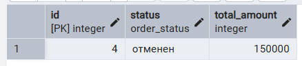

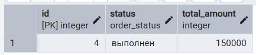

**Вывод:**
READ UNCOMMITTED: Не допускает грязное чтение даже при явном указании. Гарантирует, что транзакции видят только закоммиченные данные

READ COMMITTED: Защищает от грязного чтения. Допускает неповторяющееся чтение и фантомное чтение.

### 2.2 READ COMMITTED
2.2.1. Изменение статуса сотрудника
``` sql
-- T1 делает SELECT на статус сотрудника, сотрудник работает
BEGIN;  
SELECT status FROM employee
WHERE id = 1;

-- T2 изменяет данные о статусе сотрудника, теперь он в отпуске
BEGIN;
UPDATE employee
SET status = 'отпуск'
WHERE id = 1;
COMMIT;

-- T1 опять делает SELECT на этого же сотрудника, но он теперь отдыхает(
SELECT status FROM employee
WHERE id = 1;
COMMIT;
```
**Описание результата:**

Так как T2 изменил данные во время выполнения T1, в T1 одинаковые запросы дают разный результат
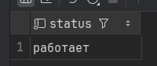


2.2.2. Клиент проверяет баланс бонусной карты, а в это время система начисляет бонусы за текущий заказ
``` sql
-- T1: Начинаем транзакцию и делаем первое чтение баланса
BEGIN;
SET TRANSACTION ISOLATION LEVEL READ COMMITTED;

SELECT card_number, points_balance 
FROM loyalty_card 
WHERE card_number = 1002;
-- СКРИНШОТ 1: Первое чтение - исходный баланс

-- T2: Начисляем бонусы и фиксируем изменения
BEGIN;
UPDATE loyalty_card 
SET points_balance = points_balance + 150 
WHERE card_number = 1002;
COMMIT;

-- T1: Делаем второе чтение в той же транзакции
SELECT card_number, points_balance 
FROM loyalty_card 
WHERE card_number = 1002;
-- СКРИНШОТ 3: Второе чтение - баланс изменился (неповторяющееся чтение)

COMMIT;
```
**Описание результата:**
T1 первый раз прочитал баланс бонусной карты. T2 изменил баланс и закоммитил изменения (начисление бонусов за заказ). T1 второй раз прочитал баланс - увидел измененное значение. Баланс изменился между двумя чтениями в одной транзакции

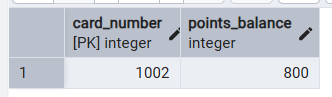


**Вывод:**
READ COMMITTED: Допускает неповторяющееся чтение (non-repeatable read). Это продемонстрировано в экспериментах 2.2.1 и 2.2.2:
В эксперименте 2.2.1: транзакция T1 дважды читала статус сотрудника и между этими чтениями транзакция T2 изменила и закоммитила новый статус. В результате второе чтение в T1 показало измененные данные.

В эксперименте 2.2.2: транзакция T1 дважды читала баланс бонусной карты, и между чтениями транзакция T2 начислила бонусы и закоммитила изменения. Второе чтение в T1 показало обновленный баланс.

### 2.3. REPEATABLE READ
2.3.1.
``` sql
-- T1 делает SELECT на статус сотрудника, сотрудник отдыхает
BEGIN TRANSACTION ISOLATION LEVEL REPEATABLE READ;  
SELECT status FROM employee
WHERE id = 1;

-- T2 изменяет данные о статусе сотрудника, теперь он работает
BEGIN;
UPDATE employee
SET status = 'отпуск'
WHERE id = 1;
COMMIT;

-- T1 опять делает SELECT на этого же сотрудника, от все еще отдыхает!
SELECT status FROM employee
WHERE id = 1;
COMMIT;
```
**Описание результата:**

T1 делает первый запрос, сотрудник отдыхает

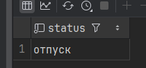

T2 изменяет данные, сотрудник теперь работает


T1 делает аналогичный запрос, но сотрудник все равно отдыхает, как и было в начале выполнения T1

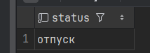

2.3.2.
``` sql
-- T1: Делает SELECT на количество клиентов с email @mail.ru - 4
BEGIN TRANSACTION ISOLATION LEVEL REPEATABLE READ;
SELECT COUNT(*) FROM client WHERE email LIKE '%@mail.ru%';

-- T2: Вставка новой записи с email @mail.ru
BEGIN;
INSERT INTO client (full_name, phone_number, email, driver_license) 
VALUES ('Фантомный Клиент', '+79169998877', 'phantom@mail.ru', 'PHANTOM123');
COMMIT;

-- T1: Повторный SELECT - все равно 4 (фантомное чтение предотвращено)
SELECT COUNT(*) FROM client WHERE email LIKE '%@mail.ru%';
COMMIT;

-- После COMMIT видим реальное количество клиентов - 5
SELECT COUNT(*) FROM client WHERE email LIKE '%@mail.ru%';
```
**Описание результата:**

T1 видит 4 клиента с email @mail.ru


T2 добавляет нового клиента с email @mail.ru


T1 все еще видит 4 клиента
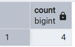

После COMMIT можно посмотреть реальные данные в client с email @mail.ru  - 5 клиентов


То есть в REPEATABLE READ транзакция видит снимок данных на момент своего начала. Несмотря на то, что T2 добавил нового клиента и закоммитил изменения, T1 продолжает видеть исходное количество клиентов до завершения своей транзакции.


### 2.4. SERIALIZABLE
2.4.1.
``` sql
-- Первый запуск транзакций
-- T1: Чтение данных из таблицы клиентов
BEGIN;
SET TRANSACTION ISOLATION LEVEL SERIALIZABLE;
SELECT COUNT(*) FROM client;
-- СКРИНШОТ 1: T1 прочитала количество клиентов

-- T2: Чтение тех же данных и вставка нового клиента
BEGIN;
SET TRANSACTION ISOLATION LEVEL SERIALIZABLE;
SELECT COUNT(*) FROM client;
INSERT INTO client (full_name, phone_number, driver_license) 
VALUES ('Client A', '+79160000001', 'DL001');
-- СКРИНШОТ 2: T2 вставила клиента

-- T2: Успешное завершение
COMMIT; 

-- T1: Вставка клиента
INSERT INTO client (full_name, phone_number, driver_license) 
VALUES ('Client B', '+79160000002', 'DL002');

-- T1: Попытка завершить транзакцию 
COMMIT; 
-- СКРИНШОТ 2: Ошибка сериализации в T1

-- Второй запуск транзакций (после ошибки)
-- T1: Чтение данных из таблицы клиентов
BEGIN;
SET TRANSACTION ISOLATION LEVEL SERIALIZABLE;
SELECT COUNT(*) FROM client;
-- СКРИНШОТ 3: T1 прочитала обновленное количество клиентов

-- T2: Чтение тех же данных и вставка нового клиента
BEGIN;
SET TRANSACTION ISOLATION LEVEL SERIALIZABLE;
SELECT COUNT(*) FROM client;
INSERT INTO client (full_name, phone_number, driver_license) 
VALUES ('Client A', '+79160000001', 'DL001');
COMMIT;
-- СКРИНШОТ 4: Ошибка уникальности в T2

-- T1: Вставка нового клиента 
INSERT INTO client (full_name, phone_number, driver_license) 
VALUES ('Client B', '+79160000002', 'DL002');

-- T1: Успешное завершение
COMMIT; 

-- Проверка результата
SELECT id, full_name, phone_number, driver_license 
FROM client 
WHERE full_name LIKE 'Client%';
-- СКРИНШОТ 5: Итоговые данные в таблице
```
**Описание результата:**
Первый запуск:
T1 и T2 читают одни и те же данные. T2 вставляет клиента и коммитит. T1 пытается вставить другого клиента и коммитит → ошибка сериализации

Второй запуск:
T1 читает обновленные данные. T2 пытается вставить того же клиента → ошибка уникальности. T1 успешно вставляет клиента и коммитит


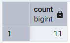
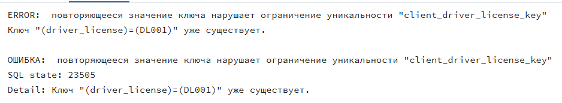


2.4.2.
``` sql
-- Первый запуск транзакций
-- T1: Чтение данных из таблицы клиентов
BEGIN TRANSACTION ISOLATION LEVEL SERIALIZABLE;
SELECT COUNT(*) FROM client;

-- T2: Чтение тех же данных и вставка нового клиента
BEGIN TRANSACTION ISOLATION LEVEL SERIALIZABLE;
SELECT COUNT(*) FROM client;
INSERT INTO client (full_name, phone_number, driver_license) 
VALUES ('Client A', '+79160000001', 'DL001');

-- T2: Успешное завершение
COMMIT; 

-- T1: Вставка клиента
INSERT INTO client (full_name, phone_number, driver_license) 
VALUES ('Client B', '+79160000002', 'DL002');

-- T1: Попытка завершить транзакцию 
COMMIT; -- не удалось сериализовать доступ из-за зависимостей чтения/записи между транзакциями

-- Второй запуск транзакций
-- T1: Чтение данных из таблицы клиентов
BEGIN TRANSACTION ISOLATION LEVEL SERIALIZABLE;
SELECT COUNT(*) FROM client;

-- T2: Чтение тех же данных и вставка нового клиента
BEGIN TRANSACTION ISOLATION LEVEL SERIALIZABLE;
SELECT COUNT(*) FROM client;
INSERT INTO client (full_name, phone_number, driver_license) 
VALUES ('Client A', '+79160000001', 'DL001');
COMMIT; -- повторяющееся значение ключа нарушает ограничение уникальности

-- T1: Вставка нового клиента 
INSERT INTO client (full_name, phone_number, driver_license) 
VALUES ('Client B', '+79160000002', 'DL002');

-- T1: Успешное завершение
COMMIT; 
```
**Описание результата:**

Исходная таблица client:


T1 и T2 читают 12 клиентов
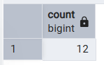

T2 успешно коммитит Client A


T1 получает ошибку сериализации при коммите Client B


При втором запуске T1 видит 13 клиентов (уже есть Client A)


T2 получает ошибку уникальности (Client A уже существует)


T1 успешно коммитит Client B


В базе оба клиента: Client A (от T2) и Client B (от T1)


**Вывод:**
READ COMMITTED показывает актуальные данные после каждого коммита, допуская неповторяющиеся чтения. REPEATABLE READ сохраняет снимок данных на начало транзакции, предотвращая неповторяющиеся и фантомные чтения. SERIALIZABLE обеспечивает полную изоляцию через откат конфликтующих транзакций.

Чем отличаются уровни:

READ COMMITTED - данные меняются между запросами в одной транзакции (баланс бонусов изменился)

REPEATABLE READ - данные стабильны внутри транзакции (количество клиентов не меняется)

SERIALIZABLE - конфликтующие операции отвергаются с ошибкой сериализации

## 3. SAVEPOINT 
## Танзакция с несколькими изменениями и точкой сохранения
3.1. Комплексное обновление данных клиента - контактные данные и бонусные баллы, где начисление баллов может вызвать ошибку
``` sql
-- T1: Начинаем транзакцию
BEGIN;

-- Изменение 1: Обновляем email клиента
UPDATE client SET email = 'клиент_обновленный@mail.ru' WHERE id = 5;
SELECT 'После изменения 1' as этап, id, full_name, email FROM client WHERE id = 5;
-- СКРИНШОТ 1: Email обновлен

-- Изменение 2: Обновляем телефон клиента  
UPDATE client SET phone_number = '+79169998877' WHERE id = 5;
SELECT 'После изменения 2' as этап, id, full_name, phone_number FROM client WHERE id = 5;
-- СКРИНШОТ 2: Телефон обновлен

-- Создаем точку сохранения
SAVEPOINT my_savepoint;

-- Изменение 3: Обновляем бонусные баллы (потенциально проблемное изменение)
UPDATE loyalty_card SET points_balance = points_balance + 500 WHERE id_client = 5;
SELECT 'После изменения 3' as этап, card_number, points_balance FROM loyalty_card WHERE id_client = 5;
-- СКРИНШОТ 3: Баллы обновлены

-- Имитируем проблему - откатываемся к точке сохранения
ROLLBACK TO SAVEPOINT my_savepoint;

-- Проверяем, что изменения до SAVEPOINT сохранились
SELECT 'После ROLLBACK TO SAVEPOINT' as этап, 
       c.id, c.full_name, c.email, c.phone_number,
       lc.points_balance
FROM client c
LEFT JOIN loyalty_card lc ON c.id = lc.id_client
WHERE c.id = 5;
-- СКРИНШОТ 4: Email и телефон сохранились, баллы - исходные

-- Фиксируем транзакцию
COMMIT;

-- Финальная проверка
SELECT 'После COMMIT' as этап, 
       c.id, c.full_name, c.email, c.phone_number,
       lc.points_balance
FROM client c
LEFT JOIN loyalty_card lc ON c.id = lc.id_client
WHERE c.id = 5;
-- СКРИНШОТ 5: Итоговое состояние данных
```
**Описание результата:**
T1 последовательно обновил email и телефон клиента. После создания SAVEPOINT обновил бонусные баллы. При ROLLBACK TO SAVEPOINT откатились только изменения после точки сохранения. Изменения email и телефона сохранились. После COMMIT зафиксировались только изменения до SAVEPOINT

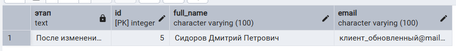

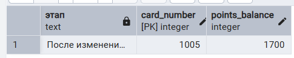

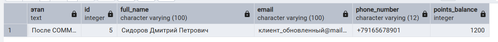

## Транзакция с двумя SAVEPOINT
3.2.
``` sql
BEGIN;
INSERT INTO employee (position, location_id, status, full_name, phone_number, hire_date)
VALUES
    ('администратор', 1, 'работает', 'Давыдов Илья Исламович', '+79864545232', '2025-11-19');

SAVEPOINT add_employee;

UPDATE employee
SET status = 'отпуск'
WHERE full_name = 'Давыдов Илья Исламович';

SAVEPOINT edit_employee;

UPDATE employee
SET status = 'уволен'
WHERE full_name = 'Давыдов Илья Исламович';

-- Сначала выполнялась транзакция с возвращением на первый savepoint, потом другая транзакция с возвращением на второй savepoint
ROLLBACK TO SAVEPOINT add_employee;

ROLLBACK TO SAVEPOINT edit_employee;

COMMIT;
```
**Описание результата:**

При возвращении к первому savepoint сотрудник работает 

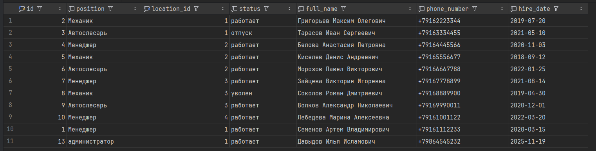

При возвращении ко второму savepoint сотрудник в отпуске


**Вывод:**
SAVEPOINT позволяет создавать точки отката внутри транзакции, сохраняя промежуточные результаты. В 3.1 при обновлении данных клиента изменения email и телефона сохранились после отката, а начисление бонусов откатилось. В 3.2 можно последовательно откатываться к разным точкам сохранения, контролируя состояние данных. Это позволяет безопасно выполнять сложные многоэтапные операции в базе данных.
