## 1. Триггеры 
### NEW:
1.1. Обновление last_visit_date при создании нового заказа клиента.
``` sql
CREATE OR REPLACE FUNCTION update_last_visit_date()
RETURNS TRIGGER AS $$
BEGIN
	UPDATE loyalty_card 
	SET last_visit_date = CURRENT_DATE
	WHERE id_client = NEW.id_client;
	RETURN NEW;
END;
$$ LANGUAGE plpgsql;

CREATE TRIGGER update_last_visit_trigger
AFTER INSERT ON client_order
FOR EACH ROW
EXECUTE FUNCTION update_last_visit_date();

-- Создаем новый заказ для клиента с id=1
INSERT INTO client_order (
    id_client, 
    id_car, 
    id_location, 
    employee_id, 
    total_amount, 
    status, 
    created_date, 
    priority
)
VALUES (1,  1,  1,  1,  500000, 'создан', CURRENT_TIMESTAMP, 'обычный' );
```
Было: 


Стало (изменилась дата у клиента с id = 1): 

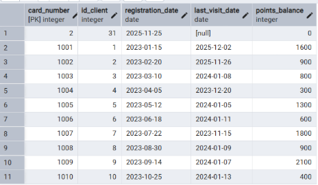

1.2. Логирование изменения статуса заказа
``` sql
CREATE OR REPLACE FUNCTION log_client_order_status()
RETURNS TRIGGER AS $$
BEGIN
    IF OLD.status IS DISTINCT FROM NEW.status THEN
        INSERT INTO client_order_status_log (order_id, status)
        VALUES (NEW.id, NEW.status);
    END IF;
    
    RETURN NEW;
END;
$$ LANGUAGE plpgsql;

CREATE TRIGGER change_client_order_status
AFTER UPDATE ON client_order
FOR EACH ROW 
EXECUTE FUNCTION log_client_order_status();

-- Изменяем статус заказа
UPDATE client_order
SET status = 'в работе'
WHERE id = 3;
```
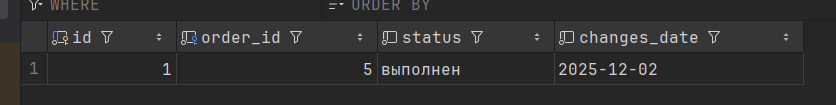

### OLD:
1.3. Логирование старого значения email при его изменении у клиента
``` sql
CREATE OR REPLACE FUNCTION log_email_change()
RETURNS TRIGGER AS $$
BEGIN
    RAISE NOTICE 'Клиент % изменил email с % на %', OLD.full_name, OLD.email, NEW.email;
    RETURN NEW;
END;
$$ LANGUAGE plpgsql;

CREATE TRIGGER email_change_trigger
BEFORE UPDATE OF email ON client
FOR EACH ROW
WHEN (OLD.email IS DISTINCT FROM NEW.email)
EXECUTE FUNCTION log_email_change();

SELECT id, full_name, email FROM client WHERE id = 1;

UPDATE client SET email = 'test_new_email@mail.ru' WHERE id = 1;

SELECT id, full_name, email FROM client WHERE id = 1;
```

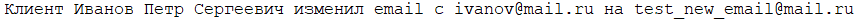


1.4. Обновление остатков товаров на точке при доставке заказа от поставщика.
``` sql
CREATE OR REPLACE FUNCTION update_remains_on_supplier_delivery()
 RETURNS TRIGGER AS $$
 BEGIN 
 	IF OLD.status != 'доставлен' AND NEW.status = 'доставлен' THEN
		-- Обновление существующих товаров
		WITH existing_items_to_update AS (
            SELECT soi.article, soi.quantity
            FROM supplier_order_items soi
			WHERE soi.id_order = OLD.id
            AND EXISTS (
                SELECT 1 FROM remains_of_goods rg
                WHERE rg.location_id = OLD.id_location
                AND rg.article = soi.article
            )
        )

        UPDATE remains_of_goods rg
		SET quantity = rg.quantity + eitu.quantity
		FROM existing_items_to_update eitu
        WHERE rg.location_id = OLD.id_location
        AND rg.article = eitu.article;

		-- Добавление новых товаров
		WITH new_items_to_insert AS (
            SELECT soi.article, soi.quantity
            FROM supplier_order_items soi
            WHERE soi.id_order = OLD.id
            AND NOT EXISTS (
                SELECT 1 FROM remains_of_goods rg
                WHERE rg.location_id = OLD.id_location
                AND rg.article = soi.article
            )
        )

		INSERT INTO remains_of_goods (location_id, article, quantity)
        SELECT OLD.id_location, article, quantity
        FROM new_items_to_insert;
        
        -- Обновление даты доставки
        IF NEW.expected_delivery_date IS NULL THEN
            NEW.expected_delivery_date := CURRENT_DATE;
        END IF;
    END IF;
    
    RETURN NEW;
END;
$$ LANGUAGE plpgsql;

CREATE TRIGGER update_remains_on_supplier_delivery_trigger
AFTER UPDATE ON order_to_supplier
FOR EACH ROW
EXECUTE FUNCTION update_remains_on_supplier_delivery();

-- Доставляем заказ
UPDATE order_to_supplier 
SET status = 'доставлен'
WHERE id = 2 AND status = 'отправлен';
```
Было: 

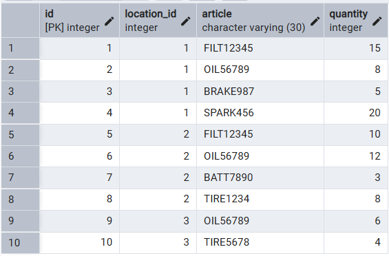

Стало (изменилось количество у остатков с id=1 и id=2): 


### BEFORE:
1.5. Проверка принадлежности автомобиля клиенту в созданном заказе
``` sql
CREATE OR REPLACE FUNCTION check_is_clients_car()
RETURNS TRIGGER AS $$
DECLARE 
    is_clients_car BOOLEAN;
BEGIN
    SELECT EXISTS(
        SELECT 1 FROM car_client 
        WHERE car_id = NEW.id_car AND client_id=NEW.id_client) 
    INTO is_clients_car;
    
    IF NOT is_clients_car THEN 
        RAISE EXCEPTION 'Автомобиль не привязан к данному клиенту';
    END IF;
    
    RETURN NEW;
END;
$$ LANGUAGE plpgsql;  

CREATE TRIGGER validate_client_order
BEFORE INSERT OR UPDATE ON client_order
FOR EACH ROW 
EXECUTE FUNCTION check_is_clients_car();

-- Создание заказа с автомобилем, не принадлежащим клиенту
INSERT INTO client_order 
    (id_client, id_car, id_location, employee_id, status, priority) 
VALUES 
    (1, 10, 1, 1, 'создан', 'низкий');
```


1.6 Проверка, что год выпуска автомобиля не больше текущего
``` sql
CREATE OR REPLACE FUNCTION check_car_year()
RETURNS TRIGGER AS $$
BEGIN
    IF NEW.year > EXTRACT(YEAR FROM CURRENT_DATE) THEN
        RAISE EXCEPTION 'Год выпуска не может быть больше текущего!';
    END IF;
    RETURN NEW;
END;
$$ LANGUAGE plpgsql;

CREATE TRIGGER before_insert_car_year
BEFORE INSERT OR UPDATE ON car
FOR EACH ROW
EXECUTE FUNCTION check_car_year();

INSERT INTO car (vin, year, license_plate, color, model_id) 
VALUES ('TESTVIN123456789', 2030, 'А999АА777', 'Черный', 1);

INSERT INTO car (vin, year, license_plate, color, model_id) 
VALUES ('TESTVIN123456789', 2024, 'А999АА777', 'Черный', 1);
```
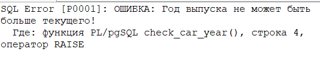

### AFTER:
1.7. Начисление бонусных баллов после выполнения заказа.
``` sql
CREATE OR REPLACE FUNCTION add_loyalty_points()
RETURNS TRIGGER AS $$
BEGIN 
	IF OLD.status != 'выполнен' AND NEW.status = 'выполнен' THEN
		UPDATE loyalty_card 
		SET points_balance = points_balance + (NEW.total_amount * 0.01)::integer
		WHERE id_client = NEW.id_client;
	END IF;
	RETURN NEW;
END;
$$ LANGUAGE plpgsql;

CREATE TRIGGER add_loyalty_points_trigger
AFTER UPDATE ON client_order
FOR EACH ROW
EXECUTE FUNCTION add_loyalty_points();

-- Выполняем заказ
UPDATE client_order 
SET 
    status = 'выполнен',
    completion_date = CURRENT_TIMESTAMP
WHERE id = 2
AND status = 'в работе';
```
Было: 

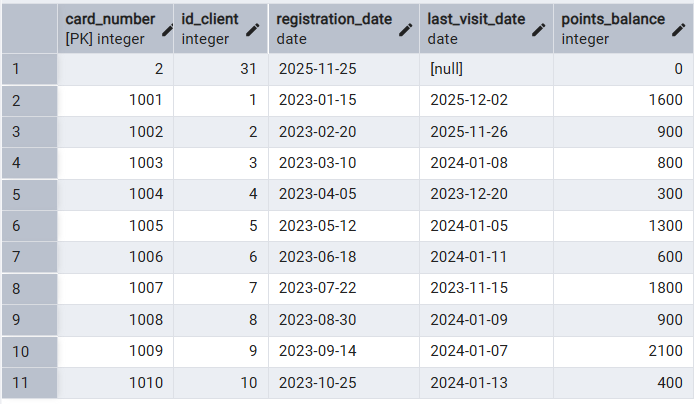

Стало (добавились бонусные баллы клиенту с id = 2): 

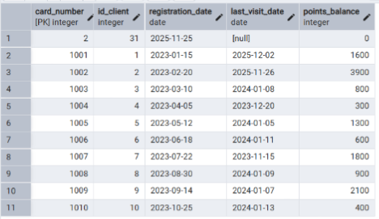

1.8. При создании клиента создается его карта лояльности
``` sql
CREATE OR REPLACE FUNCTION create_loyalty_card()
RETURNS TRIGGER AS $$
DECLARE 
BEGIN
    INSERT INTO loyalty_card 
        (id_client)
    VALUES 
        (NEW.id);
    
    RETURN NEW;
END;
$$ LANGUAGE plpgsql;  

CREATE TRIGGER create_client
AFTER INSERT OR UPDATE ON client
FOR EACH ROW 
EXECUTE FUNCTION create_loyalty_card();

-- Создание нового клиента
INSERT INTO client
    (full_name, phone_number, email, driver_license) 
VALUES 
    ('Пупкин Василий Владимирович', '+78945665457', 'pupkin@yandex.ru', '74АВ453454');
```
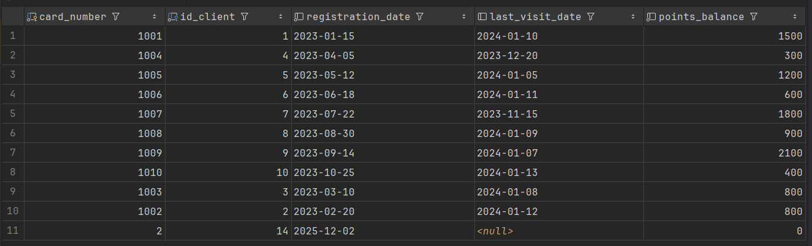

### Row level:
1.9. Автоматическое проставление даты выполнения при изменении статуса заказа
``` sql
CREATE OR REPLACE FUNCTION set_completion_date()
RETURNS TRIGGER AS $$
BEGIN
    IF NEW.status = 'выполнен' AND OLD.status != 'выполнен' THEN
        NEW.completion_date := CURRENT_TIMESTAMP;
        RAISE NOTICE 'Заказ ID % выполнен. Дата выполнения: %', NEW.id, NEW.completion_date;
    
    ELSIF OLD.status = 'выполнен' AND NEW.status != 'выполнен' THEN
        NEW.completion_date := NULL;
        RAISE NOTICE 'Заказ ID % больше не выполнен. Дата выполнения сброшена.', NEW.id;
    END IF;
    
    RETURN NEW;
END;
$$ LANGUAGE plpgsql;

CREATE TRIGGER before_order_status_update
BEFORE UPDATE OF status ON client_order
FOR EACH ROW
EXECUTE FUNCTION set_completion_date();

SELECT id, status, completion_date FROM client_order WHERE id = 2;

UPDATE client_order SET status = 'выполнен' WHERE id = 2;

SELECT id, status, completion_date FROM client_order WHERE id = 2;
```


1.10. Проверка дублирования телефонов клиентов.
``` sql
CREATE OR REPLACE FUNCTION prevent_duplicate_phone()
RETURNS TRIGGER AS $$
BEGIN
	IF EXISTS (
		SELECT 1 
		FROM client 
		WHERE phone_number = NEW.phone_number AND id != NEW.id
	) THEN 
		RAISE EXCEPTION 'Клиент с номером телефона % уже существует', NEW.phone_number;
	END IF;
	RETURN NEW;
END;
$$ LANGUAGE plpgsql;

CREATE TRIGGER prevent_duplicate_phone_trigger
BEFORE INSERT OR UPDATE ON client
FOR EACH ROW
EXECUTE FUNCTION prevent_duplicate_phone();

-- Пробуем вставить дубликат
INSERT INTO client (full_name, phone_number, email, driver_license) 
VALUES (
    'Пушкин Александр Сергеевич',
    (SELECT phone_number FROM client WHERE id = 1), 
    'duplicate@test.ru',
    '77XX000001'
);
```
Было: 


Сделала INSERT: 


Стало (ничего не добавилось): 

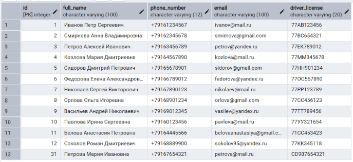

### Statement level:
1.11. Проверка на максимальное количество заказов со статусом "создан"
``` sql
CREATE OR REPLACE FUNCTION check_max_created_orders()
    RETURNS TRIGGER AS $$
DECLARE
    max_created_orders INTEGER := 10;
BEGIN
    IF (SELECT COUNT(*) FROM client_order WHERE status = 'создан') > max_created_orders THEN
        RAISE EXCEPTION 'Максимум % заказов со статусом "создан"', max_created_orders;
    END IF;
    RETURN NULL;
END;
$$ LANGUAGE plpgsql;

CREATE TRIGGER check_max_created_orders
    AFTER INSERT OR UPDATE ON client_order
    FOR EACH STATEMENT 
EXECUTE FUNCTION check_max_created_orders();

-- Добавляем 11 заказов со статусом "создан"
INSERT INTO client_order
(id_client, id_car, id_location, employee_id, status, priority, total_amount, notes)
VALUES
    (1, 1, 1, 1, 'создан', 'обычный', 150000, 'Замена масла и фильтров'),
    (2, 2, 1, 1, 'создан', 'низкий', 80000, 'Диагностика подвески'),
    (3, 3, 2, 4, 'создан', 'высокий', 250000, 'Замена тормозных колодок'),
    (4, 4, 1, 1, 'создан', 'срочный', 180000, 'Проблемы с двигателем'),
    (5, 5, 2, 4, 'создан', 'обычный', 120000, 'Замена ламп и диагностика'),
    (6, 6, 1, 1, 'создан', 'низкий', 95000, 'Шиномонтаж'),
    (7, 7, 2, 4, 'создан', 'обычный', 210000, 'Полное ТО'),
    (8, 8, 1, 1, 'создан', 'высокий', 175000, 'Замена аккумулятора'),
    (9, 9, 2, 4, 'создан', 'срочный', 300000, 'Ремонт трансмиссии'),
    (10, 10, 1, 1, 'создан', 'обычный', 135000, 'Замена свечей зажигания'), 
    (1,1,2,1,'создан', 'срочный', 200000, 'Аккуратно с рулем');
```
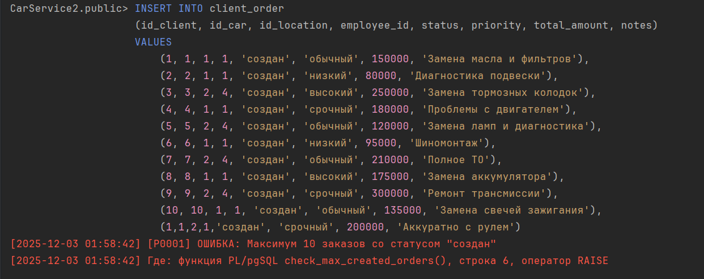

1.12. Логирование факта массового удаления записей из client_order
``` sql
CREATE OR REPLACE FUNCTION log_mass_delete()
RETURNS TRIGGER AS $$
DECLARE
    deleted_count INTEGER;
BEGIN
    GET DIAGNOSTICS deleted_count = ROW_COUNT;
    
    RAISE NOTICE 'Операция: %, Таблица: %, Затронуто строк: %', 
        TG_OP, TG_TABLE_NAME, deleted_count;
    
    RETURN NULL;
END;
$$ LANGUAGE plpgsql;

CREATE TRIGGER after_mass_delete_client_order
AFTER DELETE ON client_order
FOR EACH STATEMENT
EXECUTE FUNCTION log_mass_delete();

SELECT id, status, created_date FROM client_order co ;

DELETE FROM client_order 
WHERE status = '' 
AND created_date < '2024-01-01';
```
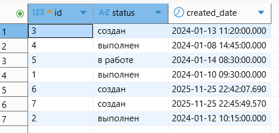
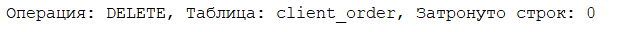

## 2. Отображение списка триггеров
2.1.
``` sql
SELECT DISTINCT
    trigger_name,
    event_object_table as table_name
FROM information_schema.triggers
WHERE trigger_schema = 'public'
ORDER BY event_object_table, trigger_name;
```
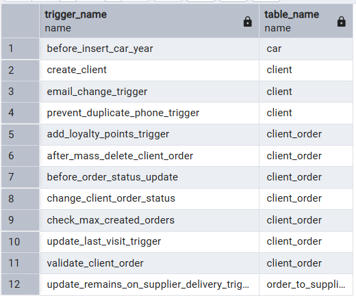


## 3. Кроны 
3.1. Новогодняя раздача 500 баллов на карту клиента
``` sql
SELECT cron.shelude(
    'new_year_bonuses',
    '0 0 1 1 *',
    'UPDATE loyalty_card SET points_balance = points_balance + 500'
);
```

3.2. Очистка старых логирований каждый день в 00:00
``` sql
SELECT cron.schedule(
    'clean_old_logs',
    '0 0 * * *',
    $$DELETE FROM error_logs WHERE created_at < NOW() - INTERVAL '30 days'$$
);
```

3.3. Ежедневная проверка истекших карт лояльности
``` sql
SELECT cron.schedule(
	'daily_loyalty_check',
	'0 0 * * *'
	$$
	-- Если карта зарегистрирована больше 2 лет назад и нет посещений больше года - деактивируем
	UPDATE loyalty_card 
	SET points_balance = 0
	WHERE registration_date < CURRENT_DATE - INTERVAL '2 years'
	AND (last_visit_date IS NULL OR last_visit_date < CURRENT_DATE - INTERVAL '1 year');
	$$
);
```

### Запрос на просмотр выполнения кронов:
3.4
``` sql
SELECT * FROM cron.job_run_details
ORDER BY start_time DESC;
```

### Запрос на просмотр кронов:
3.5
``` sql
SELECT * FROM cron.job;
```
