# Gin

## 1 запрос

### Создание
``` sql 
CREATE INDEX idx_fearues_gin ON car USING GIN (features);
```

### Сравнение 
``` sql
EXPLAIN ANALYSE
SELECT vin 
FROM car 
WHERE features @> '{"climate": "dual" }';
```
Без индексов: 

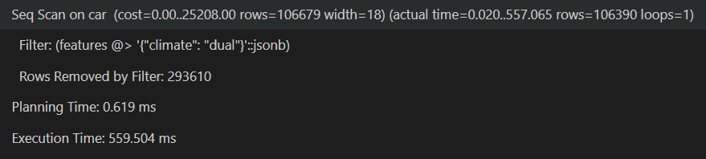

С индексом: 

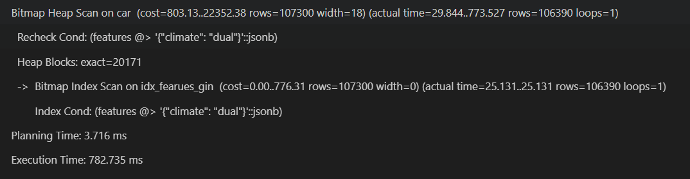

## 2 запрос

### Создание
``` sql 
CREATE INDEX idx_description_gin ON supplier USING GIN (to_tsvector('russian', description));
```

### Сравнение 
``` sql 
EXPLAIN ANALYSE
SELECT *
FROM supplier
WHERE to_tsvector('russian', description) @@ to_tsquery('russian', 'золото & Москва');
```
Без индексов: 

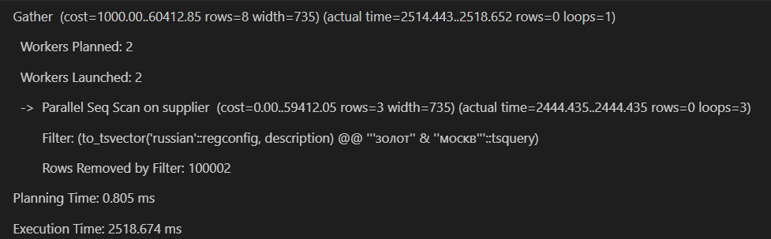

С индексом: 

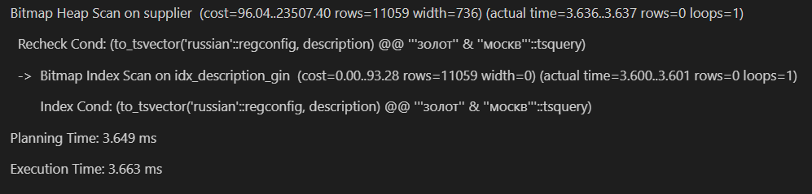


## 3 запрос

### Создание
``` sql 
CREATE INDEX idx_tags_gin ON supplier USING GIN (tags);
```

### Сравнение 
``` sql 
EXPLAIN ANALYSE
SELECT *
FROM supplier
WHERE tags @> ARRAY['BRONZE', 'long_term']::text[];
```
Без индексов: 

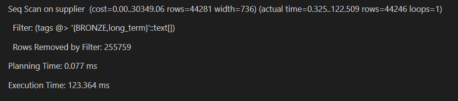

С индексом: 

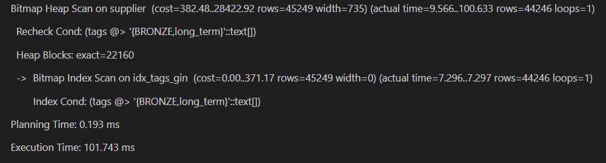

## 4 запрос

### Создание
``` sql 
CREATE INDEX idx_tags_gin ON supplier USING GIN (tags);
```

### Сравнение 
``` sql 
EXPLAIN ANALYSE
SELECT *
FROM supplier
WHERE tags @> ARRAY['BRONZE', 'long_term', 'verified_high']::text[];
```
Без индексов: 

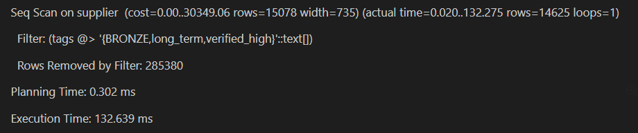

С индексом: 

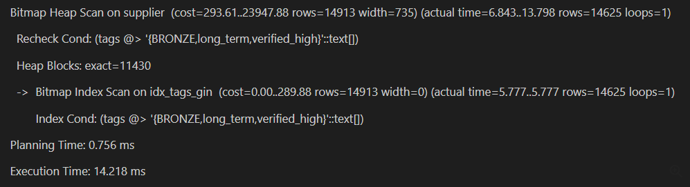

## 5 запрос

### Создание
``` sql 
CREATE INDEX idx_tags_gin ON supplier USING GIN (tags);
```

### Сравнение 
``` sql 
EXPLAIN ANALYSE
UPDATE supplier
SET tags = array_append(tags, 'cool')
WHERE tags @> ARRAY['BRONZE', 'long_term', 'verified_high']::text[];
```
Без индексов: 

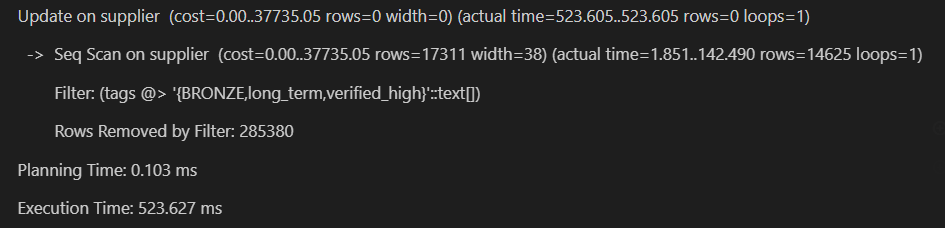

С индексом: 

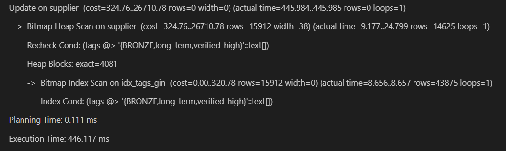

# GiST

## 1 запрос

### Создание
``` sql 
CREATE INDEX idx_description_gist ON supplier USING GIST (to_tsvector('russian', description));
```

### Сравнение 
``` sql
EXPLAIN ANALYSE
SELECT *
FROM supplier
WHERE to_tsvector('russian', description) @@ to_tsquery('russian', 'золото & Москва');
```
Без индексов: 

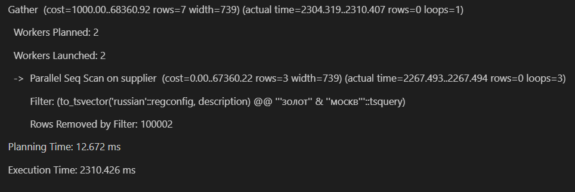

С индексом: 

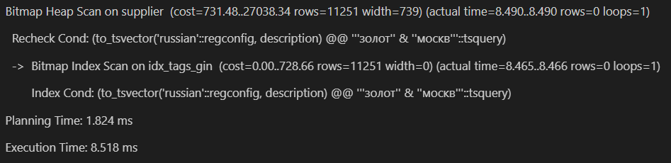

## 2 запрос

### Создание
``` sql 
CREATE INDEX idx_location_gist ON client USING GIST (location);
```

### Сравнение 
``` sql 
EXPLAIN ANALYSE
SELECT * 
FROM client
WHERE circle(point(0,0), 100) @> location;
```
Без индексов: 

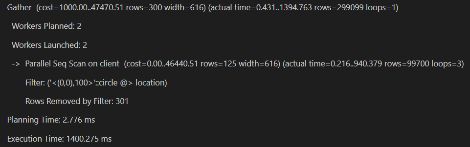

С индексом: 

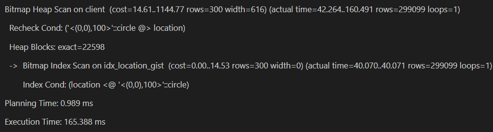


## 3 запрос

### Создание
``` sql 
CREATE INDEX idx_description_gist ON supplier USING GIST (to_tsvector('russian', description));
```

### Сравнение 
``` sql 
EXPLAIN ANALYSE
UPDATE supplier
SET metadata = metadata || '{"rating": 4.8}'::jsonb
WHERE rating = 4.8;
```
Без индексов: 


С индексом: 


## 4 запрос

### Создание
``` sql 
CREATE INDEX idx_location_gist ON supplier USING GIST (location);
```

### Сравнение 
``` sql 
EXPLAIN ANALYSE
UPDATE supplier
SET location = point(location[0] + 1, location[1] + 1)
WHERE rating > 4.89;
```
Без индексов: 

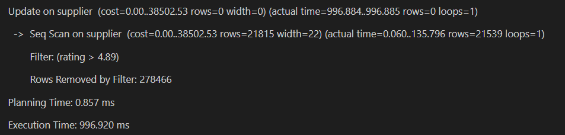

С индексом: 

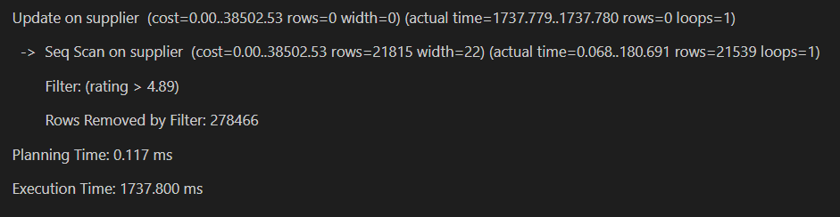

## 5 запрос

### Создание
``` sql 
CREATE INDEX idx_location_gist ON supplier USING GIST (location);
```

### Сравнение 
``` sql 
EXPLAIN ANALYSE
DELETE FROM supplier
WHERE rating > 4.80;
```
Без индексов: 

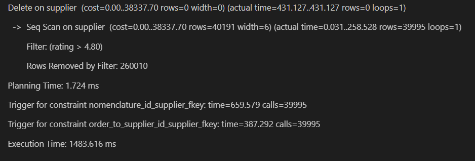

С индексом: 

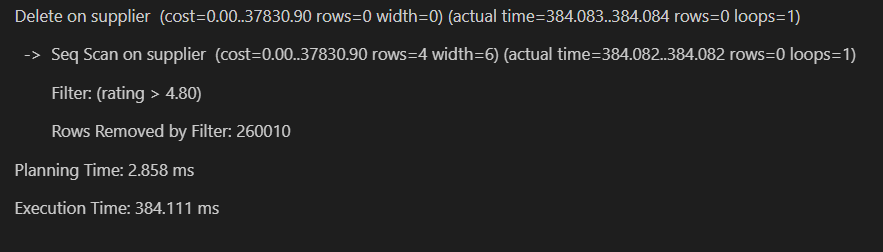


# JOIN 

## 1 запрос
``` sql 
EXPLAIN ANALYSE
SELECT full_name 
FROM client JOIN client_order ON client.id = client_order.id_client;
```
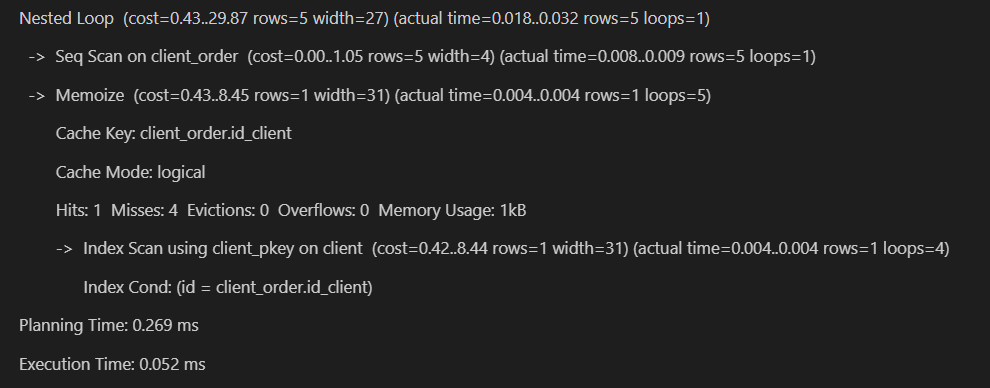

## 2 запрос
``` sql 
EXPLAIN ANALYSE
SELECT full_name 
FROM client JOIN client_order ON client.client_status = client_order.employee_id;
```

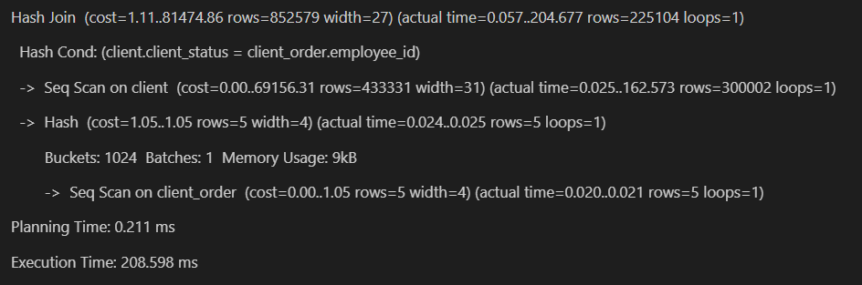

## 3 запрос
``` sql 
EXPLAIN ANALYSE
SELECT full_name 
FROM client JOIN client_order ON client.age = client_order.employee_id * 10;
```

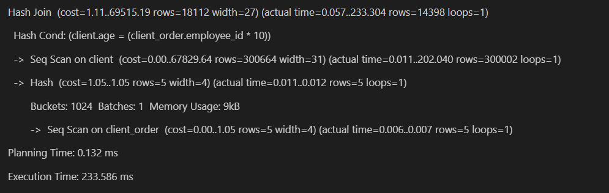

Добавила индекс: 
``` sql 
CREATE INDEX idx_age ON client(age);
```

И запрос ускорился: 
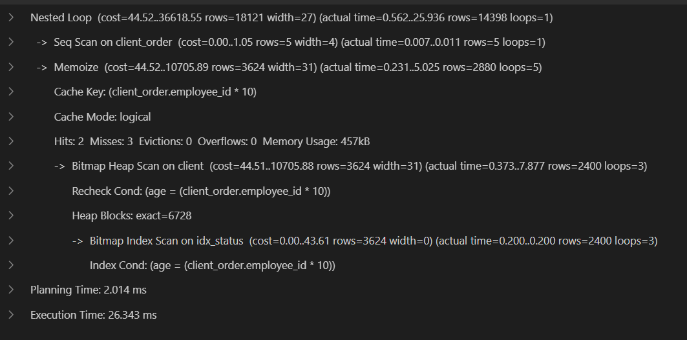

## 4 запрос
``` sql 
EXPLAIN ANALYSE
SELECT full_name 
FROM client JOIN car ON client.age * 1000 = car.mileage;
```

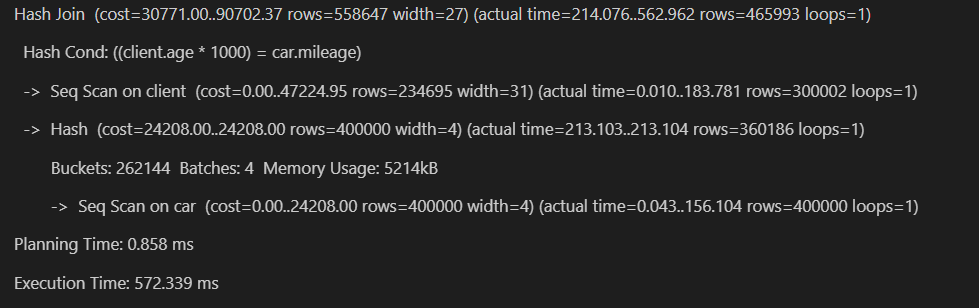

Добавила индексы: 
``` sql 
CREATE INDEX idx_status ON client(age);
CREATE INDEX idx_mileage ON car(mileage);
```

И запрос ускорился: 
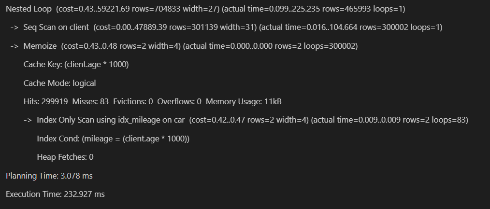
## 5 запрос

``` sql 

```

