# 1. Смоделировать обновление данных и посмотреть на параметры xmin, xmax, ctid, t_infomask
``` sql 
SELECT t_xmin, t_xmax, t_ctid, t_infomask 
FROM heap_page_items(get_raw_page('client', 0));;
```
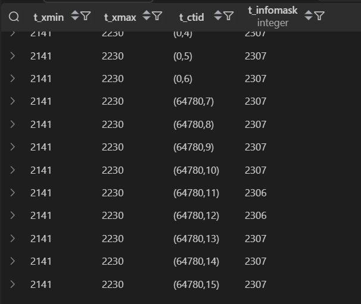

Изменила часть строк: 
``` sql 
UPDATE client
SET age = age - 1
WHERE age > 19; 
```

Теперь параметры: 
``` sql 
SELECT t_xmin, t_xmax, t_ctid, t_infomask 
FROM heap_page_items(get_raw_page('client', 0));;
``` 
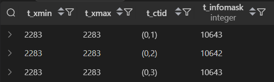

# 2. Понять что хранится в t_infomask

В t_infomask хранятся флаги, которые указывают на: 
- Наличие NULL-значений
- Наличие атрибута типа text/varchar  
- Статус транзакции
- Наличие блокировок
И т.д. 

# 3. Посмотреть на параметры из п1 в разных транзакциях

Провела параллельные транзакции

В 1 подключении 
``` sql 
-- т1 начала свое действие
BEGIN;
UPDATE location 
SET address = 'ул. Кирова, 32, Екатеринбург'
WHERE id = 2; 
```

В 2 подключении
``` sql 
-- смотрим значение параметров
SELECT t_xmin, t_xmax, t_ctid, t_infomask FROM heap_page_items(get_raw_page('location', 0));
```
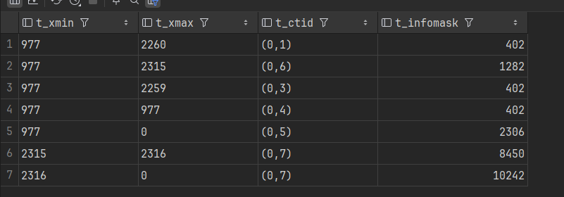


В 3 подключении
``` sql 
-- т2 параллельно начинает работу
BEGIN; 
UPDATE location 
SET address = 'ул. Кирова, 4, Екатеринбург'
WHERE id = 2; 
```

В 2 подключении 
``` sql 
-- смотрим значение параметров
SELECT t_xmin, t_xmax, t_ctid, t_infomask FROM heap_page_items(get_raw_page('location', 0));;
```
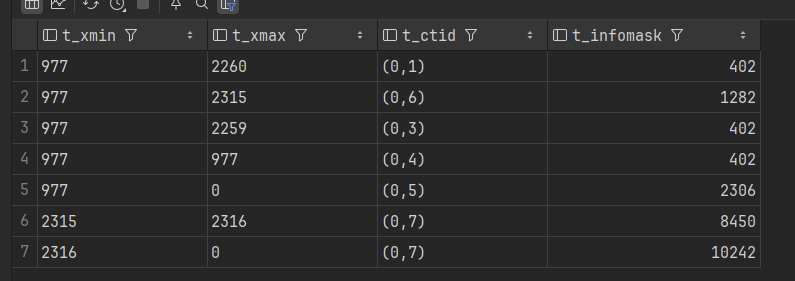

В 1 подключении 
``` sql 
-- завершаем т1
END;
```

В 2 подключении
``` sql 
-- смотрим параметры
SELECT t_xmin, t_xmax, t_ctid, t_infomask FROM heap_page_items(get_raw_page('location', 0));
```
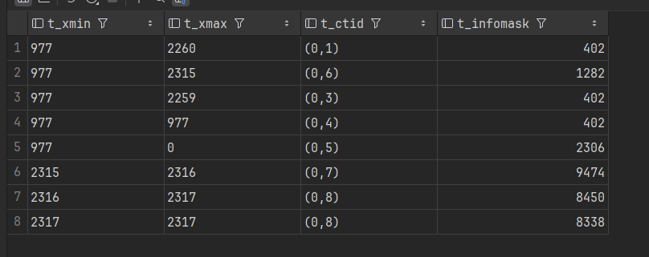

В 3 подключении
``` sql 
-- завершаем т2
END;
```

В 2 подключении
``` sql 
-- смотрим параметры
SELECT t_xmin, t_xmax, t_ctid, t_infomask FROM heap_page_items(get_raw_page('location', 0));
```
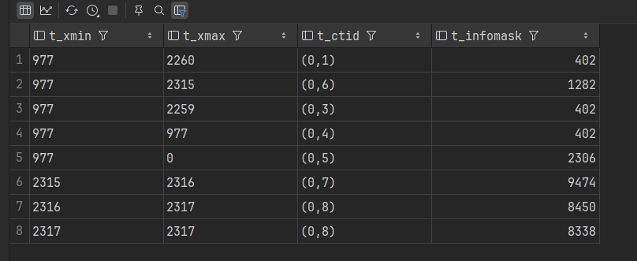

# 4. Смоделировать дедлок, описать результаты

В первом соединении блокирую локацию 2: 
``` sql 
BEGIN; 
UPDATE location 
SET address = 'ул. Кирова, 32, Екатеринбург'
WHERE id = 2; 
```

Во втором соединению блокирую локацию 1: 
``` sql 
BEGIN;
UPDATE location
SET address = 'ул. Ленина, 3, Москва'
WHERE id = 1;
```

В первом соединении пытаюсь изменить локацию 1, она ждет завершения транзакции из второго соединения
``` sql 
UPDATE location 
SET address = 'ул. Ленина, 20, Москва'
WHERE id = 1;
```

Во втором соединении пытаюсь изменить локацию 2, она ждет завершения транзакции из первого соединения
``` sql 
UPDATE location
SET address = 'ул. Кирова, 4, Екатеринбург'
WHERE id = 2;
```

Ловим дедлок: 

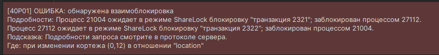

# 5.b. Режимы блокировки на уровне строк – написать запросы и посмотреть на конфликты в разных транзакциях 

## FOR UPDATE и FOR UPDATE

первое окно: 
``` sql 
BEGIN;
SELECT * FROM location WHERE id = 1 FOR UPDATE;
``` 

второе окно: 
``` sql 
BEGIN;
SELECT * FROM location WHERE id = 1 FOR UPDATE;
```

третье окно: 
``` sql 
-- Смотрим блокировки
SELECT
    locktype,
    relation::regclass,
    pid,
    mode,
    granted
FROM pg_locks
WHERE relation = 'location'::regclass;

-- Смотрим ожидающие запросы
SELECT pid, wait_event_type, wait_event, query
FROM pg_stat_activity
WHERE wait_event IS NOT NULL;
```

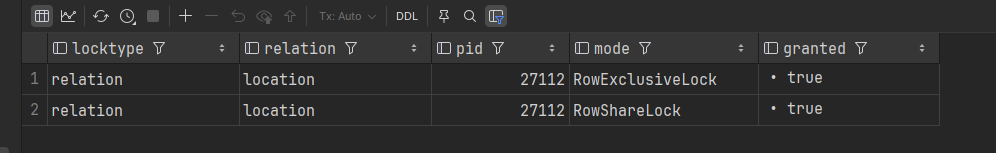

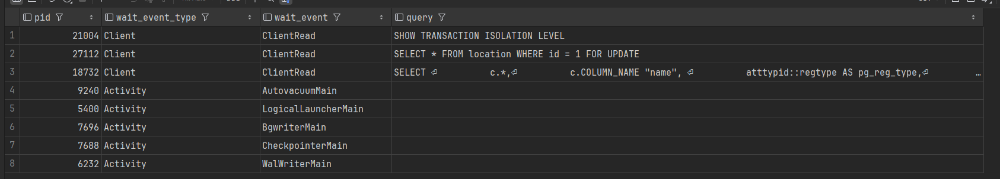

# 6. Очистка данных 

гоняем трафик: 
``` sql 
CREATE INDEX idx ON car (engine_volume);

UPDATE car 
SET engine_volume = engine_volume - 0.1
WHERE id <> 1;

UPDATE car
SET engine_volume = engine_volume + 0.1
WHERE id <> 1;
```

смотрим статистику: 
``` sql 
SELECT
    pg_size_pretty(pg_total_relation_size('car')) as total_size,
    pg_size_pretty(pg_relation_size('car')) as table_size;

SELECT
    schemaname,
    relname as tablename,  
    n_live_tup as живых_строк,
    n_dead_tup as мертвых_строк,
    last_vacuum,
    last_autovacuum,
    vacuum_count
FROM pg_stat_user_tables
WHERE relname = 'location';

```

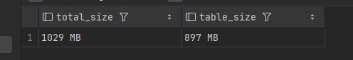

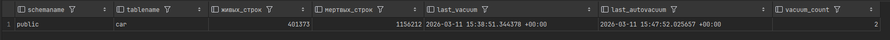

Очистка:
``` sql
VACUUM car;
```

Теперь статистика: 

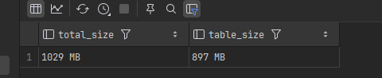

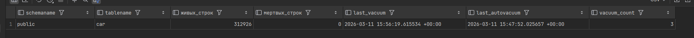

Полная очистка: 
``` sql
VACUUM FULL car;
```

Теперь статистика: 

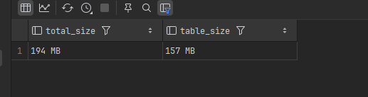

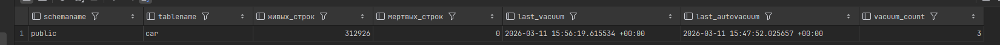