# 2. Посмотреть на изменение LSN и WAL после изменения данных
## a. Сравнение LSN до и после INSERT
### LSN до INSERT
``` sql 
SELECT pg_current_wal_lsn();
```
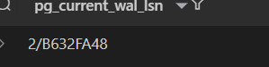

### LSN после INSERT
``` sql 
INSERT INTO service ("name", base_price, lead_time)
VALUES
('Замена кресел', 200000, 3);

SELECT pg_current_wal_lsn();
```
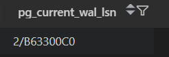

## b. Сравнение WAL до и после commit
### WAL до commit
``` sql 
CREATE EXTENSION pg_walinspect;

SELECT * FROM pg_ls_waldir();
```
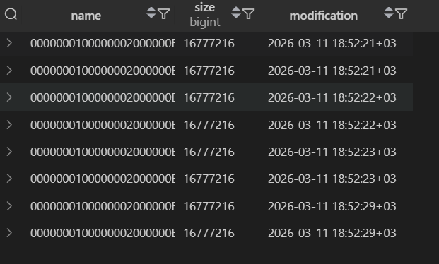

### WAL после commit
``` sql 
BEGIN; 
INSERT INTO service ("name", base_price, lead_time)
VALUES
('Замена колодок', 320000, 5);
COMMIT;

SELECT * FROM pg_ls_waldir();
```

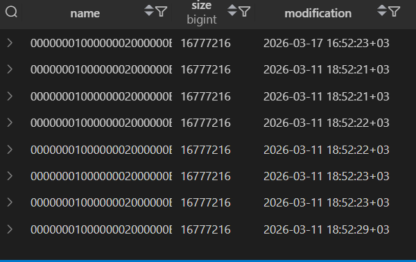

## c.
### Размер WAL до массовой операции
``` sql 
SELECT sum(size) FROM pg_ls_waldir();
```
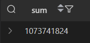
### Размер WAL после массовой операции

``` sql 
CREATE TABLE user_logs (
    id SERIAL PRIMARY KEY,
    user_id INT NOT NULL,
    action_type TEXT,
    created_at TIMESTAMP DEFAULT now()
);

INSERT INTO user_logs (user_id, action_type, created_at)
SELECT 
    floor(random() * 1000 + 1)::int,
    md5(random()::text) || md5(random()::text), 
    now()
FROM generate_series(1, 1000000);

SELECT sum(size) FROM pg_ls_waldir();
```
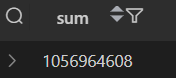

# 3. Сделать дамп БД и накрутить его на новую чистую БД 
## a. Dump только структуры базы
``` bash
"C:\Program Files\PostgreSQL\17\bin\pg_dump.exe" -U postgres -d CarService2 --schema-only -f schema.sql
```
Создался файл schema.sql

Создала тестовую БД через psql: 
``` sql 
CREATE DATABASE testdatabase
```

В консоли запустила скрипт на эту БД: 
``` bash
psql -U postgres -d testdatabase -f "C:\Users\adeli\OneDrive\Рабочий стол\practice\carserviceBD\s2\WAL\schema.sql"
```

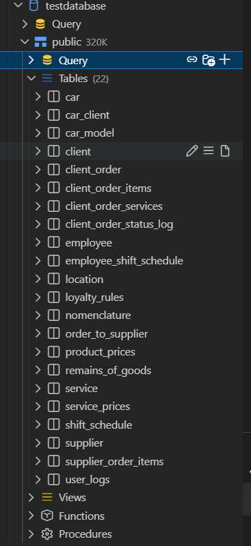

## b. Dump одной таблицы
``` bash 
"C:\Program Files\PostgreSQL\17\bin\pg_dump.exe" -U postgres -d CarService2 -t service -f table_dump.sql
```
Создался файл table_dump.sql 

Создала тестовую БД через psql: 
``` sql 
CREATE DATABASE testdb;
```

В консоли запустила скрипт на эту БД: 
``` bash 
psql -U postgres -d testdb -f "C:\Users\adeli\OneDrive\Рабочий стол\practice\carserviceBD\s2\WAL\table_dump.sql"
```

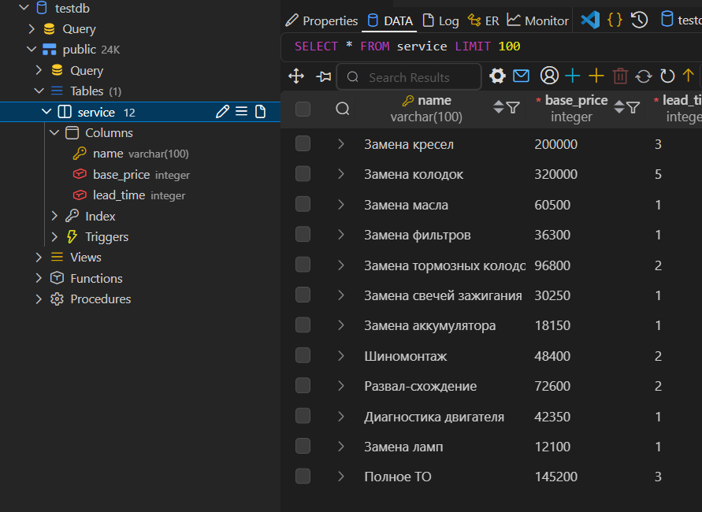


# 4. Seed 
Вставка данных: 

``` sql 
INSERT INTO loyalty_rules (min_points, discount_percent, level_name) VALUES
    (0, 0.00, 'Новичок'),
    (100, 3.00, 'Базовый'),
    (250, 5.00, 'Бронзовый'),
    (500, 7.50, 'Серебряный'),
    (1000, 10.00, 'Золотой'),
    (2500, 12.50, 'Платиновый'),
    (5000, 15.00, 'Премиум'),
    (10000, 17.50, 'VIP'),
    (25000, 20.00, 'VIP Золото'),
    (50000, 22.50, 'VIP Платина'),
    (100000, 25.00, 'Элитный'),
    (250000, 27.50, 'Элитный Плюс'),
    (500000, 30.00, 'Бизнес-класс'),
    (1000000, 32.50, 'Executive'),
    (2500000, 35.00, 'Executive Gold'),
    (5000000, 37.50, 'Executive Platinum'),
    (10000000, 40.00, 'Black Edition'),
    (25000000, 42.50, 'Black Diamond'),
    (50000000, 45.00, 'Presidential'),
    (100000000, 50.00, 'Легенда')
ON CONFLICT (min_points) DO UPDATE SET
    discount_percent = EXCLUDED.discount_percent,
    level_name = EXCLUDED.level_name
WHERE loyalty_rules.discount_percent IS DISTINCT FROM EXCLUDED.discount_percent
   OR loyalty_rules.level_name IS DISTINCT FROM EXCLUDED.level_name;
```
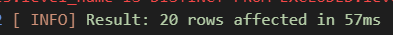

Запустили второй раз: 

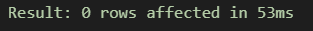

Проверка: 
``` sql 
DO $$
DECLARE
    rules_count INTEGER;
BEGIN
    SELECT COUNT(*) INTO rules_count FROM loyalty_rules;
    RAISE NOTICE 'Всего правил лояльности: %', rules_count;
    
    IF EXISTS (
        SELECT discount_percent, COUNT(*)
        FROM loyalty_rules
        GROUP BY discount_percent
        HAVING COUNT(*) > 1
    ) THEN
        RAISE WARNING 'Найдены дублирующиеся проценты скидки!';
    END IF;
END $$;
```

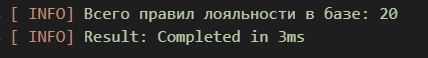