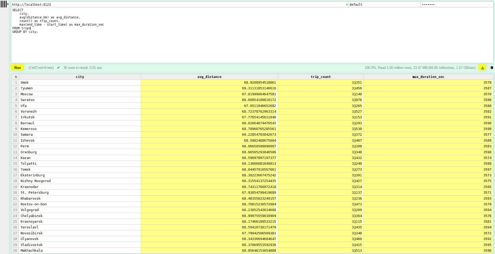

# 1. Запуск в докере
- скопирован компоуз файл
- создан и запущен контейнер

# 2. Создание таблицы

``` sql
CREATE TABLE trips (
    trip_id UInt32,
    start_time DateTime,
    end_time DateTime,
    distance_km Float32,
    city String
) ENGINE = MergeTree()
ORDER BY (city);
```

# 3. Наполнение данными

``` sql 
INSERT INTO trips
SELECT
    number AS trip_id,
    now() - rand() % 1000000 AS start_time,
    start_time + interval (rand() % 3600) second AS end_time,
    round((rand() % 1000) / 7.3, 2) AS distance_km,
    [
        'Moscow', 'St. Petersburg', 'Novosibirsk', 'Ekaterinburg', 'Kazan', 
        'Nizhny Novgorod', 'Chelyabinsk', 'Samara', 'Omsk', 'Rostov-on-Don', 
        'Ufa', 'Krasnoyarsk', 'Voronezh', 'Perm', 'Volgograd', 'Krasnodar', 
        'Saratov', 'Tyumen', 'Tolyatti', 'Izhevsk', 'Barnaul', 'Irkutsk', 
        'Ulyanovsk', 'Khabarovsk', 'Yaroslavl', 'Vladivostok', 'Makhachkala', 
        'Tomsk', 'Orenburg', 'Kemerovo'
    ][1 + (rand() % 30)] AS city
FROM numbers(1000000);
```

# 4. Написание аналитического запроса

``` sql
SELECT
    city,
    avg(distance_km) as avg_distance,
    count() as trip_count,
    max(end_time - start_time) as max_duration_sec
FROM trips
GROUP BY city; 
```


