# 1 запрос
``` sql
SELECT id, license_plate 
FROM car
WHERE engine_volume < 2;
```
## Без индексов 

### EXPLAIN
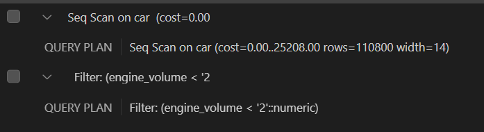

### EXPLAIN ANALYZE 
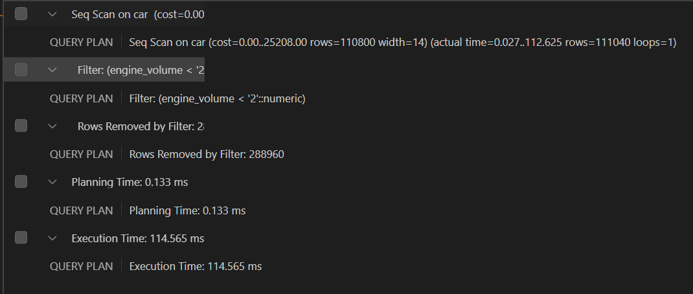

### EXPLAIN (ANALYZE, BUFFERS)
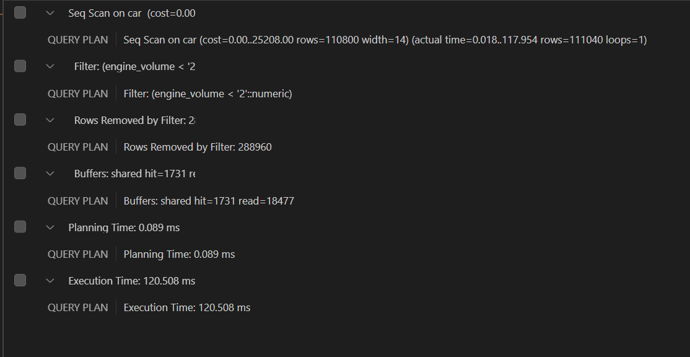

## С индексами

### EXPLAIN
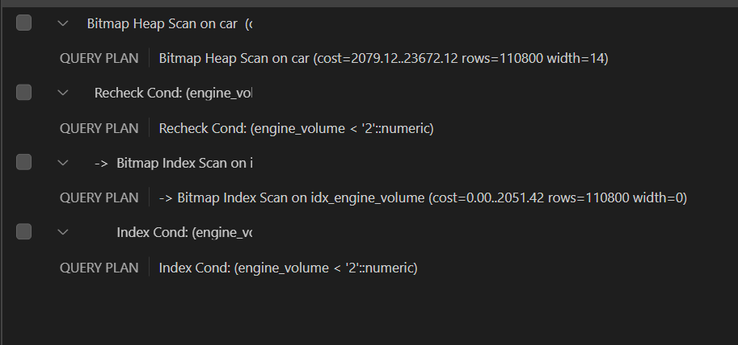

### EXPLAIN ANALYZE 
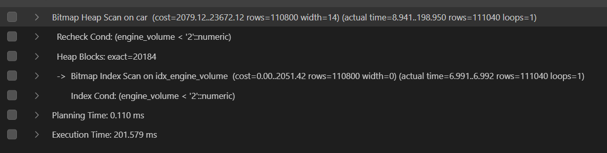

### EXPLAIN (ANALYZE, BUFFERS)
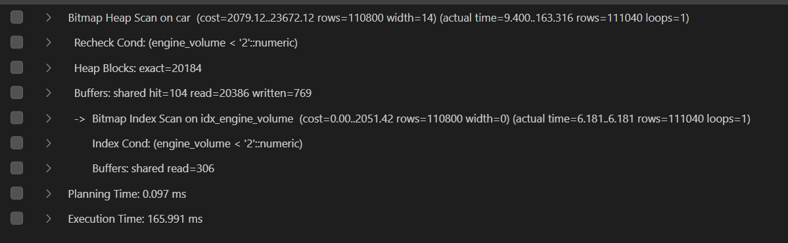

## Итог
В итоге с добавлением индексов запрос стал выполняться медленнее... Предполагаемо, потому что слишком много строк получается на выходе (около трети) + мало уникальных данных. 

# 2 запрос
Пробую аналогичный запрос, но раз у меня тут =2, а не <2, то по сути должно в ответе быть меньше значений и скорость выполнения с индексами будет выше, чем без них. 
``` sql
SELECT id, license_plate 
FROM car
WHERE engine_volume = 2;
```
## Без индексов 

### EXPLAIN


### EXPLAIN ANALYZE 
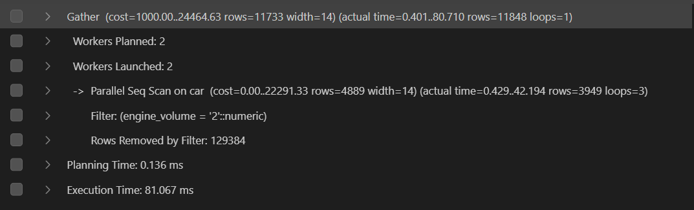

### EXPLAIN (ANALYZE, BUFFERS)
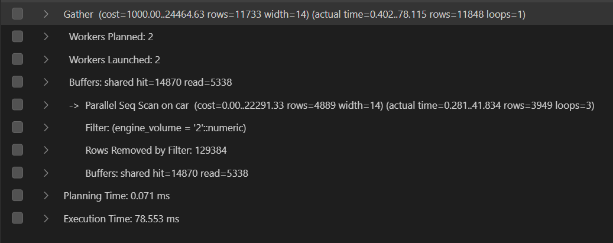

## С индексами

### EXPLAIN
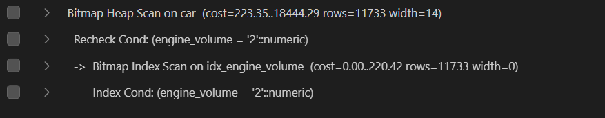

### EXPLAIN ANALYZE 
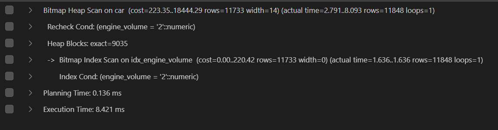

### EXPLAIN (ANALYZE, BUFFERS)
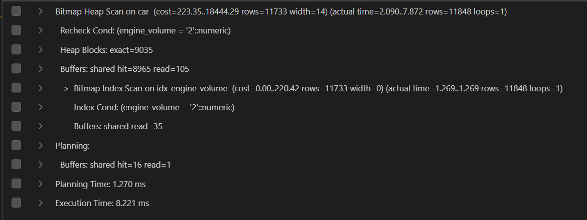

Время реально уменьшилось!!! Так что делаю вывод, что чем меньше данных будет на выходе, тем эффективнее индексы по сравнению с обычным seq scan.

# 3 запрос
По прошлому предположению, индексы сейчас должны быть эффективнее, так как данные довольно кардинальные. 
``` sql
SELECT full_name
FROM client 
WHERE full_name LIKE 'Ал%';
```
## Без индексов 

### EXPLAIN


### EXPLAIN ANALYZE 
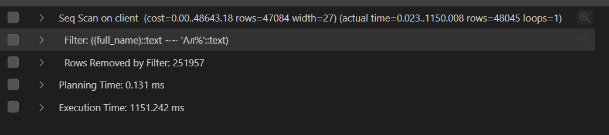

### EXPLAIN (ANALYZE, BUFFERS)
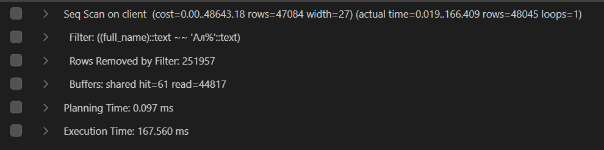

## С индексами

### EXPLAIN


### EXPLAIN ANALYZE 
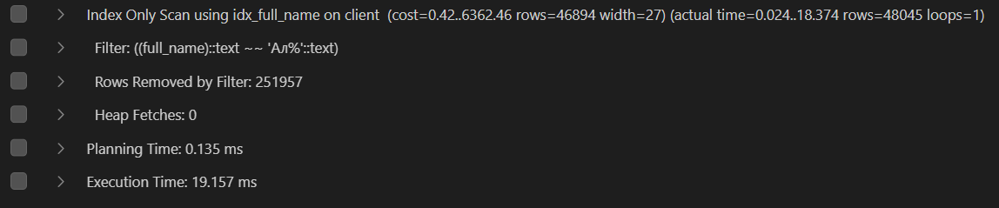

### EXPLAIN (ANALYZE, BUFFERS)
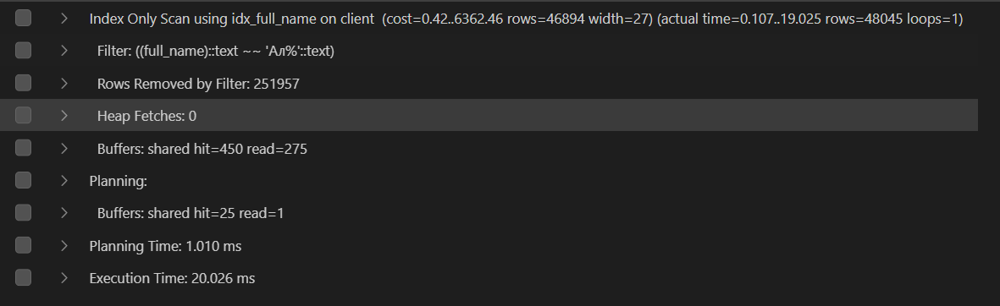

В принципе затраченное время уменьшилось кратно, так что все супер. 

# 4 запрос
``` sql
SELECT *
FROM supplier
WHERE registration_date < '2024-01-21' AND registration_date > '2023-12-09';
```
## Без индексов 

### EXPLAIN


### EXPLAIN ANALYZE 
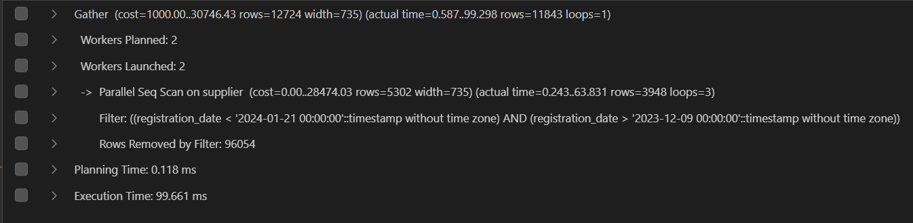

### EXPLAIN (ANALYZE, BUFFERS)
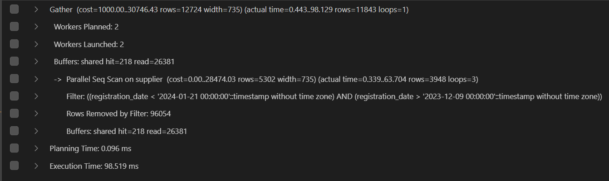

## С индексами

### EXPLAIN


### EXPLAIN ANALYZE 
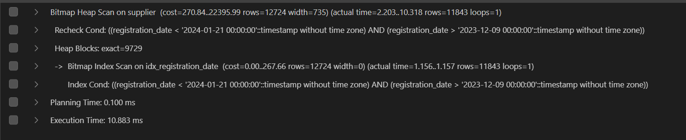

### EXPLAIN (ANALYZE, BUFFERS)
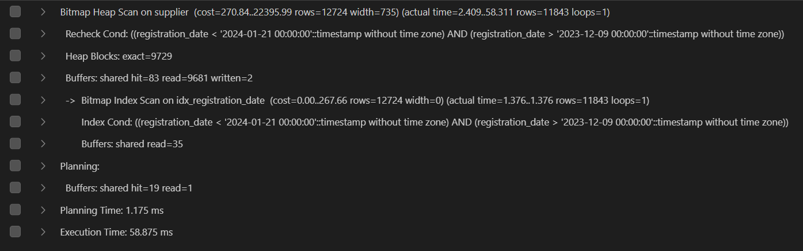

Время снова уменьшилось на порядок.
# 5 запрос
Попробуем запрос, в котором из сотен тысяч строк подходит только 3, т.е. ужасно маленький процент.
``` sql
UPDATE car 
SET color = 'белый'
WHERE vin IN ('5D3C4CA4238E40006', '6391C383CD3DC5250', 'CD6124C6AE5D932CB');
```
## Без индексов 

### EXPLAIN


### EXPLAIN ANALYZE 
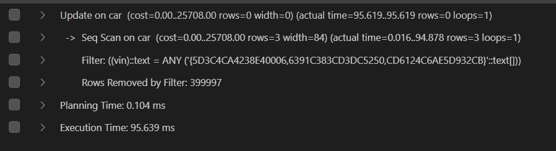

### EXPLAIN (ANALYZE, BUFFERS)
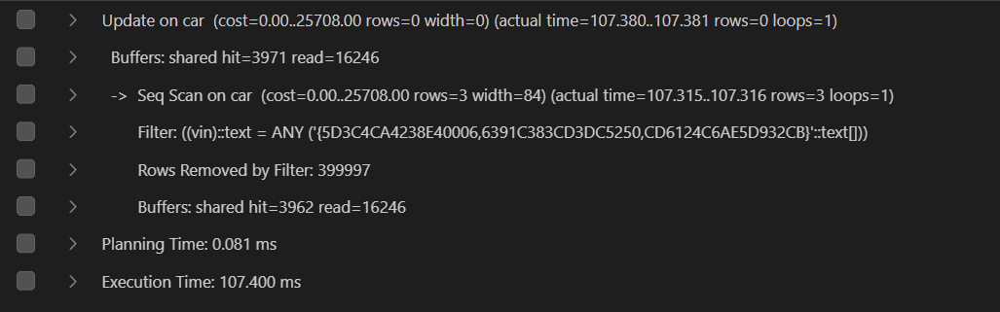

## С индексами

### EXPLAIN
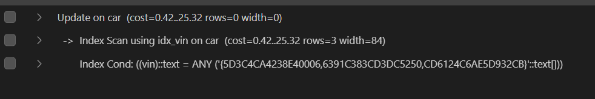

### EXPLAIN ANALYZE 
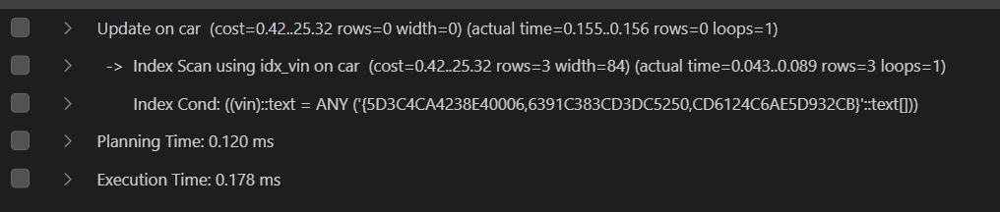

### EXPLAIN (ANALYZE, BUFFERS)
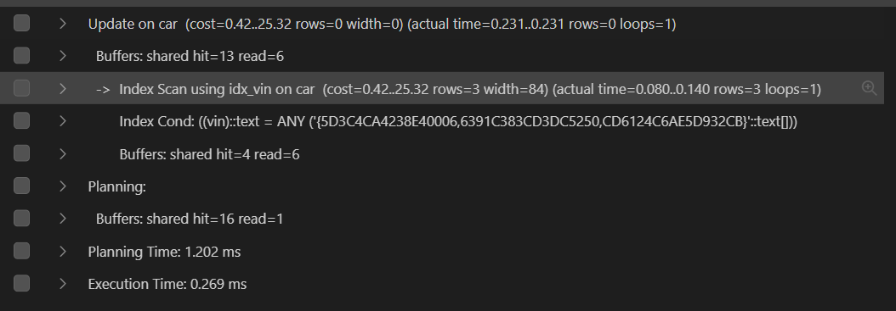

Вот теперь реально показано, какие индексы крутые. На 4 порядка быстрее запросы стали. Пушка бомба.