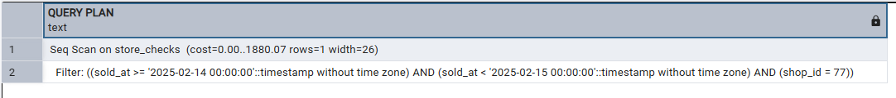
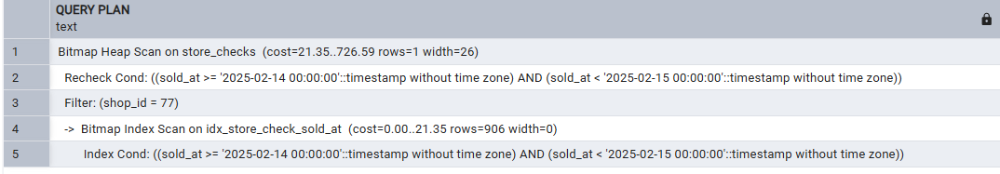
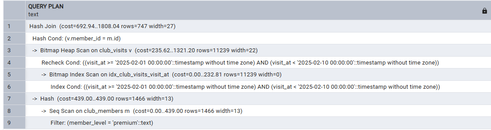
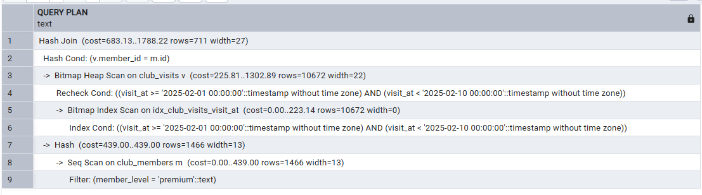
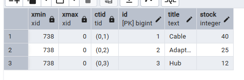
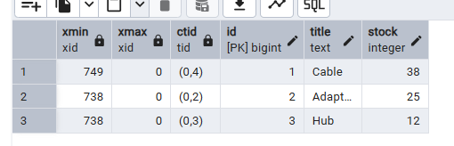
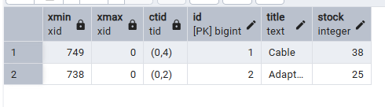

# Задание 1
## План выполнения запроса до изменений
``` sql 
EXPLAIN
SELECT id, shop_id, total_sum, sold_at
FROM store_checks
WHERE shop_id = 77
  AND sold_at >= TIMESTAMP '2025-02-14 00:00:00'
  AND sold_at < TIMESTAMP '2025-02-15 00:00:00';
```


## Полученная информация
- Seq Scan
- Оба индекса (на тип оплаты и итоговую сумму) не помогают в данном запросе, так как поиск идет по ID магазина и дате продажи
- Планировщик выбирает seq scan (то есть по факту проходится по всем записям подряд), так как не находит индекса, по которому мог бы ускорить поиск

## Подходящий индекс
Если смотреть на данные, то у всех магазинов одинаковый ID, тогда ставить индекс на ID магазина бессмысленно. А вот даты отличаются, так что на них и поставлю индекс. Буду использовать обычный B-tree индекс, так как он больше всего подходит под эту задачу.
``` sql 
CREATE INDEX idx_store_check_sold_at ON store_checks (sold_at);
```

## Повторный план выполнения
``` sql 
EXPLAIN
SELECT id, shop_id, total_sum, sold_at
FROM store_checks
WHERE shop_id = 77
  AND sold_at >= TIMESTAMP '2025-02-14 00:00:00'
  AND sold_at < TIMESTAMP '2025-02-15 00:00:00';
```


Теперь уже тип сканирования Bitmap Heap Scan, а потом уже Bitmap Index Scan, то есть планировщик использует комбинированный метод, cost уменьшился

После создания индекса стоит выполнять ANALYZE, чтобы планировщик увидел изменения, пересчитал 

# Задание 2
``` sql 
EXPLAIN
SELECT m.id, m.member_level, v.spend, v.visit_at
FROM club_members m
JOIN club_visits v ON v.member_id = m.id
WHERE m.member_level = 'premium'
  AND v.visit_at >= TIMESTAMP '2025-02-01 00:00:00'
  AND v.visit_at < TIMESTAMP '2025-02-10 00:00:00';
```


Использован Hash Join

Планировщик выбрал этот тип, потому что хоть на таблицах и есть индексы, они на атрибутах, которые не участвуют в условии JOIN, так что другие виды JOIN менее эффективные.


Создам hash index на club_members.id и club_visits_id, а также сделаю ANALYZE

``` sql 
CREATE INDEX idx_club_members_id ON club_members USING hash (id);
CREATE INDEX idx_club_visits_id ON club_visits USING hash (id);
ANALYZE club_members;
ANALYZE club_visits;
```



Опять использовался HASH JOIN, cost и количество строк немного уменьшилось


### Задание 3
``` sql 
SELECT xmin, xmax, ctid, id, title, stock
FROM warehouse_items
ORDER BY id;
```


``` sql 
UPDATE warehouse_items
SET stock = stock - 2
WHERE id = 1;

SELECT xmin, xmax, ctid, id, title, stock
FROM warehouse_items
ORDER BY id;
```



``` sql 
DELETE FROM warehouse_items
WHERE id = 3;

SELECT xmin, xmax, ctid, id, title, stock
FROM warehouse_items
ORDER BY id;
```



После UDPATE 

В модели MVCC UPDATE не просто перезаписывание строки, так как строка сначала удаляется, а потом записывается новая. 

После DELETE 

VACUUM - помечаются мертвые строки, но при этом место в памяти не прибавляется
autovacuum - автоматически запускает VACUUM и ANALYZE
VACUUM FULL - мертвые строки удаляются, таблица перестраивается, память фиpbчески увеличивается

Заблокировать таблицу может VACUUM FULL

# Задание 5

Создание секционированной таблицы и секций

``` sql 
CREATE TABLE shipment_stats (
	region_code TEXT NOT NULL,
    shipped_on DATE NOT NULL,
    packages INTEGER NOT NULL,
    avg_weight NUMERIC(8,2)
) PARTITION BY LIST (region_code);

CREATE TABLE spipmnet_stats_north PARTITION OF shipment_stats
FOR VALUES IN ('north');

CREATE TABLE spipmnet_stats_south PARTITION OF shipment_stats
FOR VALUES IN ('south');

CREATE TABLE spipmnet_stats_west PARTITION OF shipment_stats
FOR VALUES IN ('west');

CREATE TABLE spipmnet_stats_default PARTITION OF shipment_stats DEFAULT;

INSERT INTO shipment_stats SELECT * FROM shipment_stats_src;
```

Построение планов: 

```sql
SELECT region_code, shipped_on, packages
FROM shipment_stats
WHERE region_code = 'north';
```


```sql
SELECT region_code, shipped_on, packages
FROM shipment_stats
WHERE shipped_on >= DATE '2025-02-10'
  AND shipped_on < DATE '2025-02-15';
```