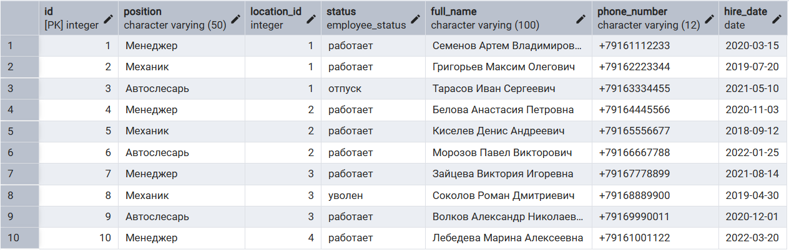
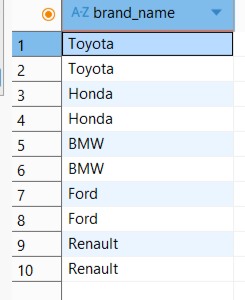

### 1. Выборка всех данных из таблицы 

1.1. Полная информация о всех сотрудниках сети.
```sql
SELECT *
FROM employee;
```
РЕЗУЛЬТАТ ВЫПОЛЕНЕНИЯ ЗАПРОСА - 

1.2. Все услуги, предоставляемые автосервисом
```sql
SELECT * 
FROM service;
```
РЕЗУЛЬТАТ ВЫПОЛЕНЕНИЯ ЗАПРОСА - 

### 2. Выборка отдельных столбцов 

2.1. Названия брендов машин клиентов
```sql
SELECT brand_name
FROM car_model;
```

РЕЗУЛЬТАТ ВЫПОЛЕНЕНИЯ ЗАПРОСА - 

2.2. ФИО и телефоны всех клиентов.
```sql
SELECT full_name, phone_number
FROM client;
```

РЕЗУЛЬТАТ ВЫПОЛЕНЕНИЯ ЗАПРОСА  - 

### 3. Присвоение новых имен столбцам при формировании выборки (as) 

3.1. Информация о имени и номере телефона каждого сотрудника
```sql
SELECT full_name AS "Имя", 
    phone_number AS "Телефон"
FROM employee;
```

РЕЗУЛЬТАТ ВЫПОЛЕНЕНИЯ ЗАПРОСА  - 

3.2. Информация о должности и месте работы сотрудников
```sql
SELECT POSITION AS Должность, location_id AS Точка
FROM employee;
```

РЕЗУЛЬТАТ ВЫПОЛЕНЕНИЯ ЗАПРОСА - 

### 4. Выборка данных с созданием вычисляемого столбца 

4.1. ID заказа клиентов, стоимость заказа и подсчет итоговой стоимости заказа с учетом НДС 20%.
```sql
SELECT id, total_amount, total_amount * 1.2 AS "Цена с НДС"
FROM client_order;
```

РЕЗУЛЬТАТ ВЫПОЛЕНЕНИЯ ЗАПРОСА  - 

4.2. ID смены, время начала и конца, ее продолжительность
```sql
SELECT id, 
    start_time, 
    end_time, 
    end_time - start_time AS "Продолжительность смены"
FROM shift_schedule;
```

РЕЗУЛЬТАТ ВЫПОЛЕНЕНИЯ ЗАПРОСА - 

### 5. Выборка данных, вычисляемые столбцы, математические функции 

5.1. Нахождение срока использования карты лояльности 
```sql
SELECT card_number, registration_date,
current_date - registration_date AS "Срок использования карты"
FROM loyalty_card;
```

РЕЗУЛЬТАТ ВЫПОЛЕНЕНИЯ ЗАПРОСА - 

5.2. ID и ФИО сотрудников, дата их найма и подсчет стажа работы.
```sql
SELECT 
    id,
    full_name,
    hire_date,
    ROUND((CURRENT_DATE - hire_date) / 365.25, 2) AS "Стаж (лет с точностью до сотых)"
FROM employee;
```

РЕЗУЛЬТАТ ВЫПОЛЕНЕНИЯ ЗАПРОСА - 

### 6. Выборка данных, вычисляемые столбцы, логические функции (case, when, else, end) 

6.1. ID, итоговая сумма заказа. В зависимости от итоговой суммы вычисляется скидка
```sql
SELECT id, 
	total_amount, 
	CASE 
		WHEN total_amount > 100000 THEN total_amount*0.95
		WHEN total_amount > 200000 THEN total_amount*0.9
		ELSE total_amount
	END AS sale
FROM client_order;
```

РЕЗУЛЬТАТ ВЫПОЛЕНЕНИЯ ЗАПРОСА - 

6.2. ID сотрудника, его статус и даты отпуска в зависимости от статуса
```sql
SELECT id,
       status,
       CASE 
           WHEN status = 'отпуск' THEN 'в процессе'
           WHEN status = 'работает' THEN '12.07-26.07'
           WHEN status = 'уволен' THEN '-'
       END AS vacation
FROM employee;
```

РЕЗУЛЬТАТ ВЫПОЛЕНЕНИЯ ЗАПРОСА - 

### 7. Выборка данных по условию (where) 

7.1. Бренды и модели автомобилей только черного цвета.
```sql
SELECT car_model.brand_name, car_model.model_name, car.color
FROM car JOIN car_model 
ON car.model_id = car_model.id
WHERE car.color = 'Черный';
```

РЕЗУЛЬТАТ ВЫПОЛЕНЕНИЯ ЗАПРОСА - 

7.2. Сотрудники, которые на данный момент работают
```sql
SELECT *
FROM employee 
WHERE status = 'работает';
```

РЕЗУЛЬТАТ ВЫПОЛЕНЕНИЯ ЗАПРОСА - 

### 8. Выборка данных, логические операции (where, операторы сравнения, not, and, or) 

8.1. Вывод всех сотрудников, устроенных на работу до 2020 года с их ФИО и статусом
```sql
SELECT full_name, status, hire_date
FROM employee 
WHERE status IN ('работает', 'отпуск') AND hire_date < '2020-01-01';
```

РЕЗУЛЬТАТ ВЫПОЛЕНЕНИЯ ЗАПРОСА - 

8.2. Заказы клиентов и их статусы с суммой больше 5000р или высоким приоритетом.
```sql
SELECT id, total_amount, priority, status
FROM client_order
WHERE total_amount > 500000 OR priority IN ('высокий', 'срочный');
```

РЕЗУЛЬТАТ ВЫПОЛЕНЕНИЯ ЗАПРОСА  - 

### 9. Выборка данных, операторы BETWEEN, IN 

9.1. Услуги, стоимость которых меньше 30 тысяч и больше 15 тысяч
```sql
SELECT name, 
	base_price
FROM service 
WHERE base_price BETWEEN 15000 AND 30000;
```

РЕЗУЛЬТАТ ВЫПОЛЕНЕНИЯ ЗАПРОСА - 

9.2. Вывод ID, модели и бренда машины клиента при условии что бренд BMW или Ford
```sql
SELECT id, model_name, brand_name
FROM car_model 
WHERE brand_name IN ('BMW', 'Ford');
```

РЕЗУЛЬТАТ ВЫПОЛЕНЕНИЯ ЗАПРОСА - 

### 10. Выборка данных с сортировкой (ORDER BY, asc, desc) 

10.1. Заказы клиентов, дата их создания и статус, отсортировав их по важности (приоритету).
```sql
SELECT id, priority, created_date, status
FROM client_order
ORDER BY CASE
WHEN priority = 'срочный' THEN 1
WHEN priority = 'высокий' THEN 2
WHEN priority = 'обычный' THEN 3
WHEN priority = 'низкий' THEN 4
END;
```

РЕЗУЛЬТАТ ВЫПОЛЕНЕНИЯ ЗАПРОСА - 

10.2. Правила лояльности от самого большого процента скидки до самого маленького
```sql
SELECT discount_percent, 
	level_name
FROM loyalty_rules 
ORDER BY discount_percent DESC;
```

РЕЗУЛЬТАТ ВЫПОЛЕНЕНИЯ ЗАПРОСА - 

### 11. Выборка данных, оператор LIKE (%, _) 

11.1. Вывод адресов и режимов работы всех точек, работающих с 8 утра
```sql
SELECT address, working_hours
FROM "location" 
WHERE working_hours LIKE '08%';
```

РЕЗУЛЬТАТ ВЫПОЛЕНЕНИЯ ЗАПРОСА - 

11.2. Стоимость услуг с заменой деталей автомобиля.
```sql
SELECT name, base_price
FROM service
WHERE name LIKE 'Замен%';
```

РЕЗУЛЬТАТ ВЫПОЛЕНЕНИЯ ЗАПРОСА - 

### 12. Выбор уникальных элементов столбца (DISTINCT) 

12.1. Все бренды автомобилей
```sql
SELECT DISTINCT brand_name
FROM car_model;
```

РЕЗУЛЬТАТ ВЫПОЛЕНЕНИЯ ЗАПРОСА - 

12.2. Вывод всех уникальных названий услуг
```sql
SELECT DISTINCT name
FROM service;
```

РЕЗУЛЬТАТ ВЫПОЛЕНЕНИЯ ЗАПРОСА - 

### 13. Выбор ограниченного количества возвращаемых строк (LIMIT, OFFSET)

13.1. Со 2 по 5 поставщики и их банковсие счета.
```sql
SELECT id, company_name, bank_account
FROM supplier
LIMIT 4 OFFSET 1; 
```

РЕЗУЛЬТАТ ВЫПОЛЕНЕНИЯ ЗАПРОСА - 

13.2. Топ 3 самые дорогие услуги
```sql
SELECT name, 
	base_price
FROM service 
ORDER BY base_price DESC
LIMIT 3;
```

РЕЗУЛЬТАТ ВЫПОЛЕНЕНИЯ ЗАПРОСА - 
 
### 14. INNER JOIN

14.1. Таблица, содержащая ФИО заказчика, его телефон, ID заказа, его стоимость и количество баллов на карте лояльности
```sql
SELECT full_name, phone_number, co.id, co.status, co.total_amount , lc.points_balance
FROM client 
INNER JOIN client_order co ON client.id = co.id_client
INNER JOIN loyalty_card lc ON client.id = lc.id_client 
```

РЕЗУЛЬТАТ ВЫПОЛЕНЕНИЯ ЗАПРОСА - 

14.2. Расписание смен сотрудников с отображением ФИО, дат смен, времени работы и адресов автосервисов.
```sql
SELECT full_name AS "ФИО сотрудника", 
	shift_date AS "Рабочий день", 
	start_time AS "Начало смены", 
	end_time AS "Окончание смены",
	l.address AS "Место работы"
FROM employee 
INNER JOIN employee_shift_schedule ess ON employee.id = ess.employee_id
INNER JOIN shift_schedule ss ON ess.shift_schedule_id = ss.id
INNER JOIN location l ON ss.location_id = l.id;
```

РЕЗУЛЬТАТ ВЫПОЛЕНЕНИЯ ЗАПРОСА - 

### 15. LEFT JOIN

15.1. Вывести все точки автосервиса с их сотрудниками, если у точки сотрудника нет - NULL 
```sql
SELECT address, 
	full_name 
FROM "location" LEFT JOIN employee 
	ON "location".id = employee.location_id;
```

РЕЗУЛЬТАТ ВЫПОЛЕНЕНИЯ ЗАПРОСА - 

15.2. Адреса точек, их телефоны, товары на точке, их артикулы
```sql
SELECT LOCATION.id, address, phone_number, rog.article, rog.quantity
FROM location
LEFT JOIN remains_of_goods rog ON location.id = rog.location_id;
```

РЕЗУЛЬТАТ ВЫПОЛЕНЕНИЯ ЗАПРОСА - 

### 16. RIGHT JOIN

16.1. Все карты лояльности, их баланс и привязанные к ним клиенты.
```sql
SELECT card_number, full_name, points_balance
FROM client
RIGHT JOIN loyalty_card 
ON client.id = loyalty_card.id_client;
```

РЕЗУЛЬТАТ ВЫПОЛЕНЕНИЯ ЗАПРОСА - 

16.2. Все возможные адреса точек и товар в наличии на них
```sql
SELECT l.address, 
 	r.article, 
 	r.quantity  
 FROM remains_of_goods r
 RIGHT JOIN "location" l 
 	ON  r.location_id = l.id
```

РЕЗУЛЬТАТ ВЫПОЛЕНЕНИЯ ЗАПРОСА - 

### 17. CROSS JOIN

17.1. Должности сотрудников, их ФИО и адреса точек, где они работают
```sql
SELECT e.POSITION, e.full_name, l.address 
FROM employee e
CROSS JOIN LOCATION l; 
```

РЕЗУЛЬТАТ ВЫПОЛЕНЕНИЯ ЗАПРОСА - 

17.2. Все комбинации поставщиков и локаций автосервисов для поставок товаров.
```sql
SELECT company_name AS "Поставщик",
    address AS "Место назначения",
    supplier.phone_number AS "Телефон поставщика",
    location.phone_number AS "Телефон автосервиса"
FROM supplier
CROSS JOIN location;
```

РЕЗУЛЬТАТ ВЫПОЛЕНЕНИЯ ЗАПРОСА - 

### 18. OUTER JOIN

18.1. Все заказы со стоимостью заказанных товаров и без
```sql
SELECT client_order.id, 
	total_price
FROM client_order 
FULL OUTER JOIN client_order_items
	ON client_order.id = client_order_items.id_order;
```

РЕЗУЛЬТАТ ВЫПОЛЕНЕНИЯ ЗАПРОСА - 

18.2. ФИО сотрудников и их должности, а также часы работы и адрес точки
```sql
SELECT 
    e.full_name,
    e.position,
    l.address,
    l.working_hours
FROM employee e
FULL OUTER JOIN LOCATION l ON e.location_id = l.id;
```

РЕЗУЛЬТАТ ВЫПОЛЕНЕНИЯ ЗАПРОСА - 

