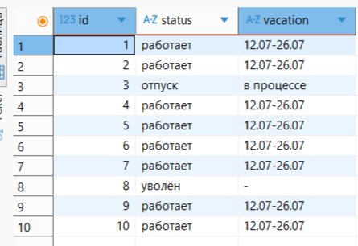

### 1. Выборка всех данных из таблицы 

1.1. Все данные о сотрудниках сети.
```sql
select *
from employee;
```
РЕЗУЛЬТАТ ВЫПОЛЕНЕНИЯ ЗАПРОСА - 

1.2
```sql

```
РЕЗУЛЬТАТ ВЫПОЛЕНЕНИЯ ЗАПРОСА - 

### 2. Выборка отдельных столбцов 

2.1
```sql

```

РЕЗУЛЬТАТ ВЫПОЛЕНЕНИЯ ЗАПРОСА - 

2.2
```sql

```

РЕЗУЛЬТАТ ВЫПОЛЕНЕНИЯ ЗАПРОСА  - 

### 3. Присвоение новых имен столбцам при формировании выборки (as) 

3.1
```sql

```

РЕЗУЛЬТАТ ВЫПОЛЕНЕНИЯ ЗАПРОСА  - 

3.2
```sql

```

РЕЗУЛЬТАТ ВЫПОЛЕНЕНИЯ ЗАПРОСА - 

### 4. Выборка данных с созданием вычисляемого столбца 

4.1
```sql

```

РЕЗУЛЬТАТ ВЫПОЛЕНЕНИЯ ЗАПРОСА  - 

4.2
```sql

```

РЕЗУЛЬТАТ ВЫПОЛЕНЕНИЯ ЗАПРОСА - 

### 5. Выборка данных, вычисляемые столбцы, математические функции 

5.1
```sql

```

РЕЗУЛЬТАТ ВЫПОЛЕНЕНИЯ ЗАПРОСА - 

5.2
```sql

```

РЕЗУЛЬТАТ ВЫПОЛЕНЕНИЯ ЗАПРОСА - 

### 6. Выборка данных, вычисляемые столбцы, логические функции (case, when, else, end) 

6.1
```sql

```

РЕЗУЛЬТАТ ВЫПОЛЕНЕНИЯ ЗАПРОСА - 

6.2
```sql

```

РЕЗУЛЬТАТ ВЫПОЛЕНЕНИЯ ЗАПРОСА - 

### 7. Выборка данных по условию (where) 

7.1
```sql

```

РЕЗУЛЬТАТ ВЫПОЛЕНЕНИЯ ЗАПРОСА - 

7.2
```sql

```

РЕЗУЛЬТАТ ВЫПОЛЕНЕНИЯ ЗАПРОСА - 

### 8. Выборка данных, логические операции (where, операторы сравнения, not, and, or) 

8.1
```sql

```

РЕЗУЛЬТАТ ВЫПОЛЕНЕНИЯ ЗАПРОСА - 

8.2
```sql

```

РЕЗУЛЬТАТ ВЫПОЛЕНЕНИЯ ЗАПРОСА  - 

### 9. Выборка данных, операторы BETWEEN, IN 

9.1
```sql

```

РЕЗУЛЬТАТ ВЫПОЛЕНЕНИЯ ЗАПРОСА - 

9.2
```sql

```

РЕЗУЛЬТАТ ВЫПОЛЕНЕНИЯ ЗАПРОСА - 

### 10. Выборка данных с сортировкой (ORDER BY, asc, desc) 

10.1
```sql

```

РЕЗУЛЬТАТ ВЫПОЛЕНЕНИЯ ЗАПРОСА - 

10.2
```sql

```

РЕЗУЛЬТАТ ВЫПОЛЕНЕНИЯ ЗАПРОСА - 

### 11. Выборка данных, оператор LIKE (%, _) 

11.1
```sql

```

РЕЗУЛЬТАТ ВЫПОЛЕНЕНИЯ ЗАПРОСА - 

11.2
```sql

```

РЕЗУЛЬТАТ ВЫПОЛЕНЕНИЯ ЗАПРОСА - 

### 12. Выбор уникальных элементов столбца (DISTINCT) 

12.1
```sql

```

РЕЗУЛЬТАТ ВЫПОЛЕНЕНИЯ ЗАПРОСА - 

12.2
```sql

```

РЕЗУЛЬТАТ ВЫПОЛЕНЕНИЯ ЗАПРОСА - 

### 13. Выбор ограниченного количества возвращаемых строк (LIMIT, OFFSET)

13.1
```sql

```

РЕЗУЛЬТАТ ВЫПОЛЕНЕНИЯ ЗАПРОСА - 

13.2
```sql

```

РЕЗУЛЬТАТ ВЫПОЛЕНЕНИЯ ЗАПРОСА - 
 
### 14. INNER JOIN

14.1
```sql

```

РЕЗУЛЬТАТ ВЫПОЛЕНЕНИЯ ЗАПРОСА - 

14.2
```sql

```

РЕЗУЛЬТАТ ВЫПОЛЕНЕНИЯ ЗАПРОСА - 

### 15. LEFT JOIN

15.1
```sql

```

РЕЗУЛЬТАТ ВЫПОЛЕНЕНИЯ ЗАПРОСА - 

15.2
```sql

```

РЕЗУЛЬТАТ ВЫПОЛЕНЕНИЯ ЗАПРОСА - 

### 16. RIGHT JOIN

16.1
```sql

```

РЕЗУЛЬТАТ ВЫПОЛЕНЕНИЯ ЗАПРОСА - 

16.2
```sql

```

РЕЗУЛЬТАТ ВЫПОЛЕНЕНИЯ ЗАПРОСА - 

### 17. CROSS JOIN

17.1
```sql

```

РЕЗУЛЬТАТ ВЫПОЛЕНЕНИЯ ЗАПРОСА - 

17.2
```sql

```

РЕЗУЛЬТАТ ВЫПОЛЕНЕНИЯ ЗАПРОСА - 

### 18. OUTER JOIN

18.1
```sql

```

РЕЗУЛЬТАТ ВЫПОЛЕНЕНИЯ ЗАПРОСА - 

18.2
```sql

```

РЕЗУЛЬТАТ ВЫПОЛЕНЕНИЯ ЗАПРОСА - 
