### 1. SELECT

1.1. Дата самого первого заказа
```sql
SELECT (SELECT MIN(created_date) FROM client_order) AS first_order_date;
```
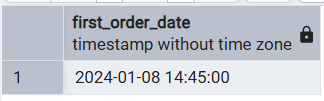

1.2. Один из клиентов
```sql
SELECT (SELECT full_name FROM client LIMIT 1) AS one_client;
```
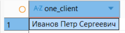

1.3. Год выпуска самой старой обслуживаемой машины
```sql
SELECT (SELECT min(year) FROM car) AS the_year_of_oldest_car;
```
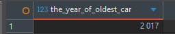

### 2. FROM 

2.1. Клиенты, у которых хотя бы 1 заказ
```sql
SELECT full_name, order_count
FROM (
    SELECT c.full_name, COUNT(co.id) AS order_count
    FROM client c
    LEFT JOIN client_order co ON c.id = co.id_client
    GROUP BY c.full_name
) 
WHERE order_count > 0;
```


2.2. Сотрудники с количеством смен за январь 2024
```sql
SELECT e.full_name, shift_count
FROM (
    SELECT ess.employee_id, COUNT(*) as shift_count
    FROM employee_shift_schedule ess
    JOIN shift_schedule ss ON ess.shift_schedule_id = ss.id
    WHERE EXTRACT(YEAR FROM ss.shift_date) = 2024 AND EXTRACT(MONTH FROM ss.shift_date) = 1
    GROUP BY ess.employee_id
) AS employee_shifts
JOIN employee e ON employee_shifts.employee_id = e.id;
```


2.3. Точки, у которых средний чек больше 500к
```sql
SELECT id_location, avg_amount FROM
	(SELECT id_location, avg(total_amount) AS avg_amount
	FROM client_order co 
	GROUP BY id_location) AS sub
WHERE sub.avg_amount > 500000;
```


### 3. WHERE

3.1. Крупные заказы, стоимость которых выше средней стоимости выполненных заказов
```sql
SELECT *
FROM client_order
WHERE total_amount > (
    SELECT AVG(total_amount) 
    FROM client_order 
    WHERE status = 'выполнен'
);
```

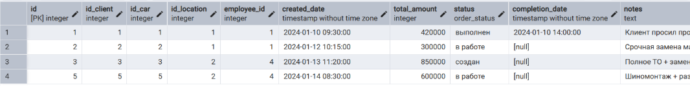

3.2. Самый долго работающий сотрудник
```sql
SELECT * FROM employee 
WHERE hire_date = (SELECT MIN(hire_date) FROM employee);
```

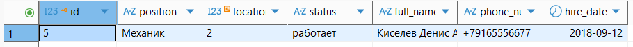

3.3. Карты клиентов, баллы которой соответствуют скидке 0%
```sql
SELECT * FROM loyalty_card lc 
WHERE lc.points_balance < (SELECT lr.min_points FROM loyalty_rules lr
							ORDER BY lr.min_points ASC LIMIT 1 OFFSET 1);
```
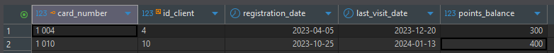

### 4. HAVING

4.1. Наиболее популярные товары с объемом продаж выше среднего
```sql
SELECT n.article, n.name as product_name, SUM(coi.quantity) as total_sold
FROM client_order_items coi
INNER JOIN product_prices pp ON coi.product_price_id = pp.id
INNER JOIN nomenclature n ON pp.article = n.article 
GROUP BY n.article
HAVING SUM(coi.quantity) > (SELECT AVG(quantity) FROM client_order_items);
```


4.2. Поставщики, у которых средняя стоимость товара выше общей средней
```sql
SELECT s.company_name, AVG(pp.price) as avg_price
FROM supplier s
JOIN nomenclature n ON s.id = n.id_supplier
JOIN product_prices pp ON n.article = pp.article
GROUP BY s.id, s.company_name
HAVING AVG(pp.price) > (SELECT AVG(price) FROM product_prices);
```

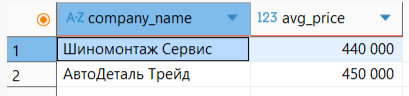

4.3. Точки, на которых сумма чека выше среднего
```sql
SELECT id_location FROM client_order co 
GROUP BY co.id_location 
HAVING avg(co.total_amount) > (SELECT avg(total_amount) FROM client_order);
```
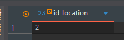

### 5. ALL

5.1. Товары, которые не продавались
```sql
SELECT DISTINCT name 
FROM nomenclature
WHERE article <> ALL (
    SELECT DISTINCT article 
    FROM client_order_items coi 
    INNER JOIN product_prices pp ON coi.product_price_id = pp.id
);
```


5.2. Услуги, которые никогда не заказывались в срочных заказах
```sql
SELECT name
FROM service
WHERE name <> ALL (
    SELECT DISTINCT sp.service_name
    FROM client_order_services cos
    JOIN service_prices sp ON cos.service_price_id = sp.id
    JOIN client_order co ON cos.id_order = co.id
    WHERE co.priority = 'срочный'
);
```


5.3. Точки, на которых не было заказов
```sql
SELECT * FROM "location" 
WHERE id <> ALL (SELECT id_location FROM client_order);
```


### 6. IN

6.1. Товары, которые есть в наличии в московском филиале в количестве более 10 штук
```sql
SELECT *
FROM nomenclature
WHERE article IN (
    SELECT article 
    FROM remains_of_goods 
    WHERE quantity > 10
    AND location_id IN (
        SELECT id 
        FROM location 
        WHERE address LIKE '%Москва%'
    )
);
```

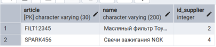

6.2. Клиенты, чьи автомобили обслуживались в московском филиале
```sql
SELECT full_name
FROM client
WHERE id IN (
    SELECT DISTINCT id_client
    FROM client_order
    WHERE id_location IN (
        SELECT id 
        FROM location 
        WHERE address LIKE '%Москва%'
    )
);
```


6.3. Поставщики, к которым делались заказы
```sql
SELECT * FROM supplier s 
WHERE s.id IN (SELECT ots.id_supplier FROM order_to_supplier ots);
```


### 7. ANY

7.1. Услуги, которые заказывались хотя бы раз
```sql
SELECT name, base_price
FROM service
WHERE name = ANY (
    SELECT service_name 
    FROM client_order_services cos 
    INNER JOIN service_prices sp ON cos.service_price_id = sp.id
);
```


7.2. Товары, цена которых выше любой цены на услуги
```sql
SELECT article, name
FROM nomenclature
WHERE article = ANY (
    SELECT article
    FROM product_prices
    WHERE price > ANY (
        SELECT price
        FROM service_prices
    )
);
```

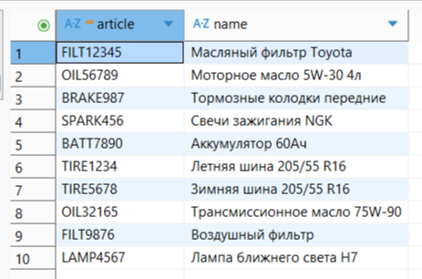

7.3. Сотрудники, отработавшие хотя бы 2 смены
```sql
SELECT * FROM employee e 
WHERE e.id = ANY (SELECT ess.employee_id FROM employee_shift_schedule ess
	GROUP BY ess.employee_id 
	HAVING count(ess.id) >= 2);
```
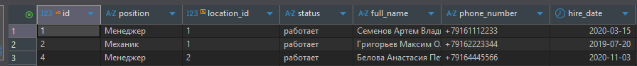

### 8. EXIST

8.1. Клиенты, у которых есть карта лояльности с более чем 1000 баллов
```sql
SELECT *
FROM client c
WHERE EXISTS (
    SELECT 1 
    FROM loyalty_card lc 
    WHERE lc.id_client = c.id 
    AND lc.points_balance > 1000
);
```


8.2. Филиалы, в которых есть сотрудники в отпуске
```sql
SELECT *
FROM location l
WHERE EXISTS (
    SELECT 1
    FROM employee e
    WHERE e.location_id = l.id AND e.status = 'отпуск'
);
```


8.3. Поставщики, к которым есть заказы, находящиеся в процессе
```sql
SELECT * FROM supplier s 
WHERE EXISTS (SELECT 1 FROM order_to_supplier ots 
	WHERE ots.status IN ('формируется', 'отправлен'));
```


### 9. Сравнение по нескольким столбцам

9.1. Клиенты с такой же датой регистрации и балансом баллов, как у VIP-клиентов (level_name = 'Золото')
```sql
SELECT full_name, registration_date, points_balance
FROM client 
INNER JOIN loyalty_card ON client.id = loyalty_card.id_client
WHERE (registration_date, points_balance) IN (
    SELECT registration_date, points_balance
    FROM loyalty_card lc
    INNER JOIN loyalty_rules lr ON lc.points_balance >= lr.min_points
    WHERE level_name = 'Золото'
);
```

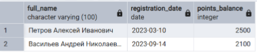

9.2. Товары с максимальной ценой в каждой категории 
```sql
SELECT n.article, n.name, pp.price
FROM nomenclature n
JOIN product_prices pp ON n.article = pp.article
WHERE (n.id_supplier, pp.price) IN (
    SELECT n2.id_supplier, MAX(pp2.price)
    FROM nomenclature n2
    JOIN product_prices pp2 ON n2.article = pp2.article
    GROUP BY n2.id_supplier
);
```


9.3. Услуги, имеющие такую же стоимость, что и товары, в одном заказе
```sql
SELECT * FROM client_order_services t 
WHERE (t.id_order, t.total_price) IN 
	(SELECT coi.id_order, coi.total_price 
	FROM client_order_items coi);
```


### 10. Коррелированные подзапросы

10.1. Количество работающих сотрудников в каждом филиале
```sql
SELECT 
    address,
    (SELECT COUNT(*) 
     FROM employee e 
     WHERE e.location_id = l.id AND e.status = 'работает') 
	 AS active_employees
FROM location l;
```


10.2. Суммарная стоимость заказов для каждого клиента
```sql
SELECT 
    c.full_name,
    (SELECT SUM(total_amount) 
     FROM client_order co 
     WHERE co.id_client = c.id) as total_orders_amount
FROM client c;
```

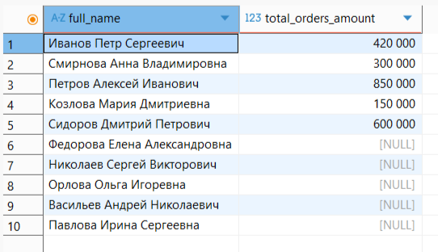

10.3. Количество заказов на каждой локации
```sql
SELECT l.address, (SELECT count(*) FROM client_order co 
	WHERE co.id_location = l.id) AS orders_count 
FROM "location" l;
```

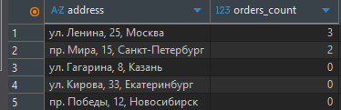

10.4. Товары с текущей ценой
```sql
SELECT 
    n.article,
    n.name,
    (SELECT price 
     FROM product_prices pp 
     WHERE pp.article = n.article 
     ORDER BY effective_date DESC 
     LIMIT 1) 
	 AS current_price
FROM nomenclature n;
```

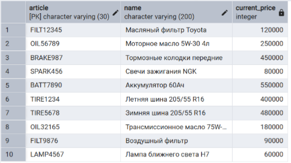

10.5. Количество различных услуг в каждом заказе
```sql
SELECT 
    co.id as order_id,
    (SELECT COUNT(DISTINCT sp.service_name) 
     FROM client_order_services cos 
     JOIN service_prices sp ON cos.service_price_id = sp.id
     WHERE cos.id_order = co.id) as unique_services_count
FROM client_order co;
```

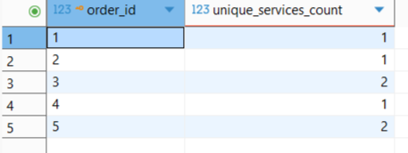
