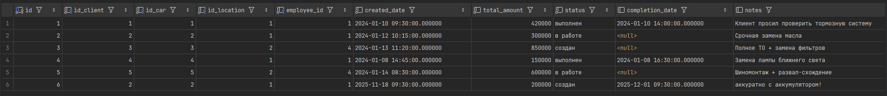
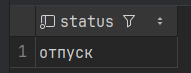
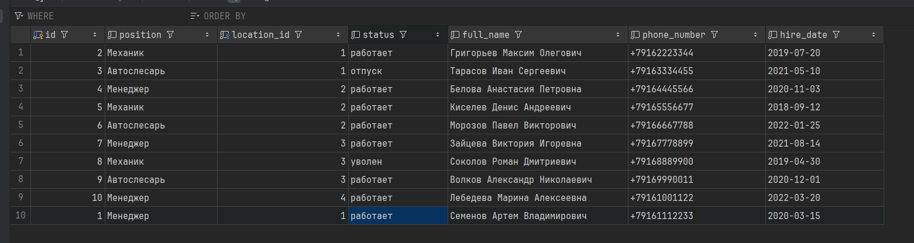

## 1. Базовые операции с транзакциями
### 1.1. Транзакции с BEGIN ... COMMIT, которые добавляют новые записи в одну таблицу и обновляют связанные записи в другой.
1.1.1. При оформлении заказа начисляются баллы на карту клиента
``` sql
BEGIN;
INSERT INTO client_order
(id_client, id_car, id_location, employee_id, total_amount, status, completion_date, notes, created_date)
VALUES
    (2, 2, 1, 1, 200000, 'создан', '2025-12-01 09:30:00.000000', 'аккуратно с аккумулятором!', '2025-11-18 09:30:00.000000');
UPDATE loyalty_card
SET points_balance = points_balance + 20
WHERE id_client = 2;
COMMIT;
```
**Описание результата:**

Заказ создан, баллы изменились



1.1.2.
``` sql

```
**Описание результата:**


### 1.2. Транзакции с ROLLBACK вместо COMMIT.
1.2.1. При оформлении заказа начисляются баллы на карту клиента
``` sql
BEGIN;
INSERT INTO client_order
(id_client, id_car, id_location, employee_id, total_amount, status, completion_date, notes, created_date)
VALUES
    (2, 2, 1, 1, 200000, 'создан', '2025-12-01 09:30:00.000000', 'аккуратно с аккумулятором!', '2025-11-18 09:30:00.000000');
UPDATE loyalty_card
SET points_balance = points_balance + 20
WHERE id_client = 2;
ROLLBACK;
```
**Описание результата:**

Ничего не изменилось


1.2.2. 
``` sql

```
Описание результата:


### 1.3. Транзакции с ошибкой.
1.3.1. Деление на ноль
``` sql
BEGIN;
INSERT INTO client_order
(id_client, id_car, id_location, employee_id, total_amount, status, completion_date, notes, created_date)
VALUES
    (2, 2, 1, 1, 200000, 'создан', '2025-12-01 09:30:00.000000', 'аккуратно с аккумулятором!', '2025-11-18 09:30:00.000000');
UPDATE loyalty_card
SET points_balance = points_balance / 0
WHERE id_client = 2;
ROLLBACK;
```
**Описание результата:**

При выполнении возникла ошибка во втором запросе, ни в client_order, ни в loyalty_card изменения внесены не были


1.3.2.
``` sql

```
Описание результата:


Вывод:


## 2. Уровни изоляции
### 2.1. READ UNCOMMITTED / READ COMMITTED
2.1.1. 
``` sql

```
Описание результата:


2.1.2.
``` sql

```
Описание результата:


### 2.2 READ COMMITTED
2.2.1. Изменение статуса сотрудника
``` sql
-- T1 делает SELECT на статус сотрудника, сотрудник работает
BEGIN;  
SELECT status FROM employee
WHERE id = 1;

-- T2 изменяет данные о статусе сотрудника, теперь он в отпуске
BEGIN;
UPDATE employee
SET status = 'отпуск'
WHERE id = 1;
COMMIT;

-- T1 опять делает SELECT на этого же сотрудника, но он теперь отдыхает(
SELECT status FROM employee
WHERE id = 1;
COMMIT;
```
Описание результата:

Так как T2 изменил данные во время выполнения T1, в T1 одинаковые запросы дают разный результат



2.2.2.
``` sql

```
Описание результата:


### 2.3. REPEATABLE READ
2.3.1.
``` sql
-- T1 делает SELECT на статус сотрудника, сотрудник отдыхает
BEGIN TRANSACTION ISOLATION LEVEL REPEATABLE READ;  
SELECT status FROM employee
WHERE id = 1;

-- T2 изменяет данные о статусе сотрудника, теперь он работает
BEGIN;
UPDATE employee
SET status = 'отпуск'
WHERE id = 1;
COMMIT;

-- T1 опять делает SELECT на этого же сотрудника, от все еще отдыхает!
SELECT status FROM employee
WHERE id = 1;
COMMIT;
```
Описание результата:

T1 делает первый запрос, сотрудник отдыхает


T2 изменяет данные, сотрудник теперь работает



T1 делает аналогичный запрос, но сотрудник все равно отдыхает, как и было в начале выполнения T1


2.3.2.
``` sql

```
Описание результата:


### 2.4. SERIALIZABLE
2.4.1.
``` sql

```
Описание результата:


2.4.2.
``` sql

```
Описание результата:


Вывод:


## 3. SAVEPOINT 
## Танзакция с несколькими изменениями и точкой сохранения
3.1.
``` sql

```
Описание результата:


## Транзакция с двумя SAVEPOINT
3.2.
``` sql

```
Описание результата:


Вывод: