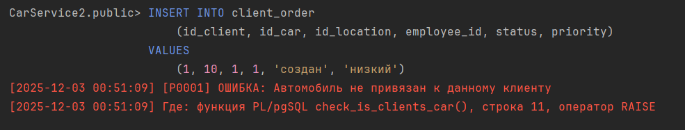

## 1. Триггеры 
### NEW:
1.1
``` sql

```


1.2. Логирование изменения статуса заказа
``` sql
CREATE OR REPLACE FUNCTION log_client_order_status()
RETURNS TRIGGER AS $$
BEGIN
    IF OLD.status IS DISTINCT FROM NEW.status THEN
        INSERT INTO client_order_status_log (order_id, status)
        VALUES (NEW.id, NEW.status);
    END IF;
    
    RETURN NEW;
END;
$$ LANGUAGE plpgsql;

CREATE TRIGGER change_client_order_status
AFTER UPDATE ON client_order
FOR EACH ROW 
EXECUTE FUNCTION log_client_order_status();

-- Изменяем статус заказа
UPDATE client_order
SET status = 'в работе'
WHERE id = 3;
```


### OLD:
1.3. Логирование старого значения email при его изменении у клиента
``` sql

```


1.4.
``` sql

```


### BEFORE:
1.5. Проверка принадлежности автомобиля клиенту в созданном заказе
``` sql
CREATE OR REPLACE FUNCTION check_is_clients_car()
RETURNS TRIGGER AS $$
DECLARE 
    is_clients_car BOOLEAN;
BEGIN
    SELECT EXISTS(
        SELECT 1 FROM car_client 
        WHERE car_id = NEW.id_car AND client_id=NEW.id_client) 
    INTO is_clients_car;
    
    IF NOT is_clients_car THEN 
        RAISE EXCEPTION 'Автомобиль не привязан к данному клиенту';
    END IF;
    
    RETURN NEW;
END;
$$ LANGUAGE plpgsql;  

CREATE TRIGGER validate_client_order
BEFORE INSERT OR UPDATE ON client_order
FOR EACH ROW 
EXECUTE FUNCTION check_is_clients_car();

-- Создание заказа с автомобилем, не принадлежащим клиенту
INSERT INTO client_order 
    (id_client, id_car, id_location, employee_id, status, priority) 
VALUES 
    (1, 10, 1, 1, 'создан', 'низкий');
```


1.6 Проверка, что год выпуска автомобиля не больше текущего
``` sql

```


### AFTER:
1.7.
``` sql

```


1.8. При создании клиента создается его карта лояльности
``` sql
CREATE OR REPLACE FUNCTION create_loyalty_card()
RETURNS TRIGGER AS $$
DECLARE 
BEGIN
    INSERT INTO loyalty_card 
        (id_client)
    VALUES 
        (NEW.id);
    
    RETURN NEW;
END;
$$ LANGUAGE plpgsql;  

CREATE TRIGGER create_client
AFTER INSERT OR UPDATE ON client
FOR EACH ROW 
EXECUTE FUNCTION create_loyalty_card();

-- Создание нового клиента
INSERT INTO client
    (full_name, phone_number, email, driver_license) 
VALUES 
    ('Пупкин Василий Владимирович', '+78945665457', 'pupkin@yandex.ru', '74АВ453454');
```


### Row level:
1.9. Автоматическое проставление даты выполнения при изменении статуса заказа
``` sql

```


1.10.
``` sql

```


### Statement level:
1.11. Проверка на максимальное количество заказов со статусом "создан"
``` sql
CREATE OR REPLACE FUNCTION check_max_created_orders()
    RETURNS TRIGGER AS $$
DECLARE
    max_created_orders INTEGER := 10;
BEGIN
    IF (SELECT COUNT(*) FROM client_order WHERE status = 'создан') > max_created_orders THEN
        RAISE EXCEPTION 'Максимум % заказов со статусом "создан"', max_created_orders;
    END IF;
    RETURN NULL;
END;
$$ LANGUAGE plpgsql;

CREATE TRIGGER check_max_created_orders
    AFTER INSERT OR UPDATE ON client_order
    FOR EACH STATEMENT 
EXECUTE FUNCTION check_max_created_orders();

-- Добавляем 11 заказов со статусом "создан"
INSERT INTO client_order
(id_client, id_car, id_location, employee_id, status, priority, total_amount, notes)
VALUES
    (1, 1, 1, 1, 'создан', 'обычный', 150000, 'Замена масла и фильтров'),
    (2, 2, 1, 1, 'создан', 'низкий', 80000, 'Диагностика подвески'),
    (3, 3, 2, 4, 'создан', 'высокий', 250000, 'Замена тормозных колодок'),
    (4, 4, 1, 1, 'создан', 'срочный', 180000, 'Проблемы с двигателем'),
    (5, 5, 2, 4, 'создан', 'обычный', 120000, 'Замена ламп и диагностика'),
    (6, 6, 1, 1, 'создан', 'низкий', 95000, 'Шиномонтаж'),
    (7, 7, 2, 4, 'создан', 'обычный', 210000, 'Полное ТО'),
    (8, 8, 1, 1, 'создан', 'высокий', 175000, 'Замена аккумулятора'),
    (9, 9, 2, 4, 'создан', 'срочный', 300000, 'Ремонт трансмиссии'),
    (10, 10, 1, 1, 'создан', 'обычный', 135000, 'Замена свечей зажигания'), 
    (1,1,2,1,'создан', 'срочный', 200000, 'Аккуратно с рулем');
```


1.12.
``` sql

```


## 2. Отображение списка триггеров
2.1.
``` sql

```


## 3. Кроны 
3.1. Новогодняя раздача 500 баллов на карту клиента
``` sql
SELECT cron.shelude(
    'new_year_bonuses',
    '0 0 1 1 *',
    'UPDATE loyalty_card SET points_balance = points_balance + 500'
);
```


3.2.
``` sql

```


3.3.
``` sql

```


### Запрос на просмотр выполнения кронов:
3.4
``` sql
SELECT * FROM cron.job_run_details
ORDER BY start_time DESC;
```


### Запрос на просмотр кронов:
3.5
``` sql

```

