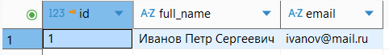
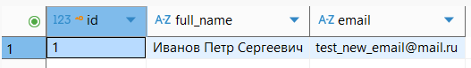
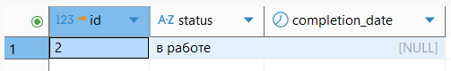
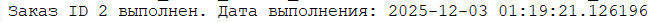
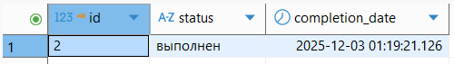

## 1. Триггеры 
### NEW:
1.1
``` sql

```


1.2.
``` sql

```


### OLD:
1.3.
``` sql
CREATE OR REPLACE FUNCTION log_email_change()
RETURNS TRIGGER AS $$
BEGIN
    RAISE NOTICE 'Клиент % изменил email с % на %', OLD.full_name, OLD.email, NEW.email;
    RETURN NEW;
END;
$$ LANGUAGE plpgsql;

CREATE TRIGGER email_change_trigger
BEFORE UPDATE OF email ON client
FOR EACH ROW
WHEN (OLD.email IS DISTINCT FROM NEW.email)
EXECUTE FUNCTION log_email_change();

SELECT id, full_name, email FROM client WHERE id = 1;

UPDATE client SET email = 'test_new_email@mail.ru' WHERE id = 1;

SELECT id, full_name, email FROM client WHERE id = 1;
```




1.4.
``` sql

```


### BEFORE:
1.5.
``` sql

```


1.6
``` sql
CREATE OR REPLACE FUNCTION check_car_year()
RETURNS TRIGGER AS $$
BEGIN
    IF NEW.year > EXTRACT(YEAR FROM CURRENT_DATE) THEN
        RAISE EXCEPTION 'Год выпуска не может быть больше текущего!';
    END IF;
    RETURN NEW;
END;
$$ LANGUAGE plpgsql;

CREATE TRIGGER before_insert_car_year
BEFORE INSERT OR UPDATE ON car
FOR EACH ROW
EXECUTE FUNCTION check_car_year();

INSERT INTO car (vin, year, license_plate, color, model_id) 
VALUES ('TESTVIN123456789', 2030, 'А999АА777', 'Черный', 1);

INSERT INTO car (vin, year, license_plate, color, model_id) 
VALUES ('TESTVIN123456789', 2024, 'А999АА777', 'Черный', 1);
```


### AFTER:
1.7.
``` sql

```


1.8.
``` sql

```


### Row level:
1.9.
``` sql
CREATE OR REPLACE FUNCTION set_completion_date()
RETURNS TRIGGER AS $$
BEGIN
    IF NEW.status = 'выполнен' AND OLD.status != 'выполнен' THEN
        NEW.completion_date := CURRENT_TIMESTAMP;
        RAISE NOTICE 'Заказ ID % выполнен. Дата выполнения: %', NEW.id, NEW.completion_date;
    
    ELSIF OLD.status = 'выполнен' AND NEW.status != 'выполнен' THEN
        NEW.completion_date := NULL;
        RAISE NOTICE 'Заказ ID % больше не выполнен. Дата выполнения сброшена.', NEW.id;
    END IF;
    
    RETURN NEW;
END;
$$ LANGUAGE plpgsql;

DROP TRIGGER IF EXISTS before_order_status_update ON client_order;
CREATE TRIGGER before_order_status_update
BEFORE UPDATE OF status ON client_order
FOR EACH ROW
EXECUTE FUNCTION set_completion_date();

SELECT id, status, completion_date FROM client_order WHERE id = 2;

UPDATE client_order SET status = 'выполнен' WHERE id = 2;

SELECT id, status, completion_date FROM client_order WHERE id = 2;
```




1.10.
``` sql

```


### Statement level:
1.11.
``` sql

```


1.12.
``` sql
CREATE OR REPLACE FUNCTION log_mass_delete()
RETURNS TRIGGER AS $$
DECLARE
    deleted_count INTEGER;
BEGIN
    GET DIAGNOSTICS deleted_count = ROW_COUNT;
    
    RAISE NOTICE 'Операция: %, Таблица: %, Затронуто строк: %', 
        TG_OP, TG_TABLE_NAME, deleted_count;
    
    RETURN NULL;
END;
$$ LANGUAGE plpgsql;

DROP TRIGGER IF EXISTS after_mass_delete_client_order ON client_order;
CREATE TRIGGER after_mass_delete_client_order
AFTER DELETE ON client_order
FOR EACH STATEMENT
EXECUTE FUNCTION log_mass_delete();

SELECT id, status, created_date FROM client_order co ;

DELETE FROM client_order 
WHERE status = '' 
AND created_date < '2024-01-01';
```


## 2. Отображение списка триггеров
2.1.
``` sql

```


## 3. Кроны 
3.1.
``` sql

```


3.2.
``` sql

```


3.3.
``` sql

```


### Запрос на просмотр выполнения кронов:
3.4
``` sql

```


### Запрос на просмотр кронов:
3.5
``` sql

```

